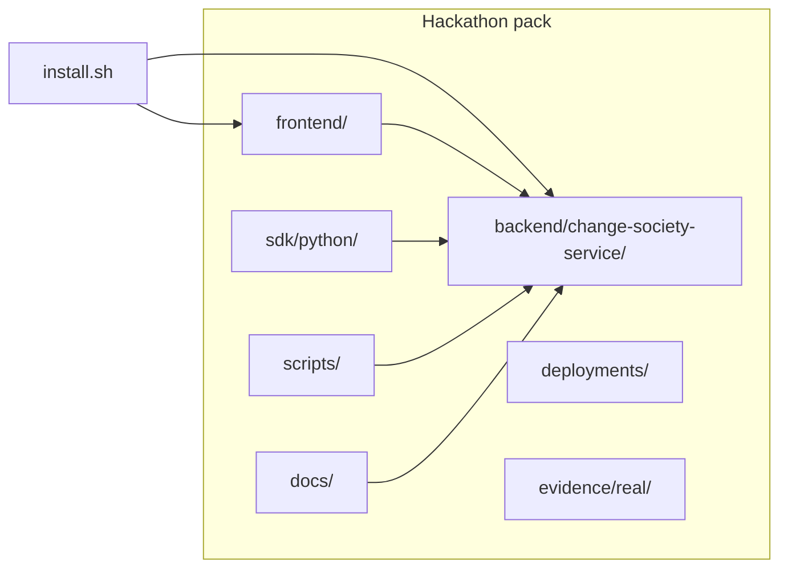
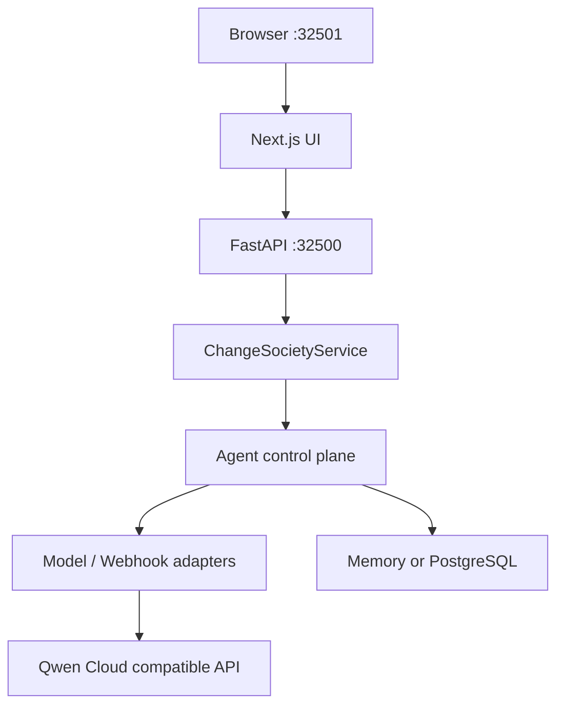

# Change Society — Hackathon Pack

**Qwen Cloud Hackathon · Track 3 — Agent Society**

Governed multi-agent decision system: ambiguous software changes → negotiation, policy evidence, human approval.

**Judges / reviewers:** start at **[docs/14-submission-pack-index.md](docs/14-submission-pack-index.md)** (5-minute review path, evidence links, compliance API).

**Public repository:** [AgentCore-Hackathon](https://github.com/Sepideh-Asadollahi/AgentCore-Hackathon) — this tree is what gets published from `hackathon/` (see [scripts/README.md](scripts/README.md#publish-to-public-github-entrant-local)).

## Install

From **this folder** (standalone clone) or **`hackathon/`** inside the full AgentCore monorepo:

```bash
bash install.sh
bash install.sh --profile verify   # + deterministic society smoke
```

**Manual Python `.venv`** (repo root):

```bash
python3 -m venv .venv
.venv/bin/pip install --upgrade pip
.venv/bin/pip install -r requirements.txt
.venv/bin/pip install -r requirements-dev.txt   # optional: pytest
```

Copy **`hackathon/.env.example`** → **`.env`** for live Qwen (`QWEN_API_KEY`); install creates a safe **demo** `.env` if missing (`fake` model, no keys required for judges).

**Monorepo only:**

```bash
bash hackathon/install.sh --profile verify
```

Details: [docs/01-quickstart.md](docs/01-quickstart.md).

## Run locally (judges)

```bash
# after install — from repo root, with .env sourced if you use custom settings
PYTHONPATH=backend/change-society-service/src .venv/bin/python -m uvicorn change_society.main:app --host 127.0.0.1 --port 32500
```

Frontend: `cd frontend && npm run dev` → [http://localhost:32501](http://localhost:32501) (cinematic demo).

Compliance self-check: `curl -sS http://127.0.0.1:32500/api/v1/hackathon/submission-compliance | jq .`

## Repository layout



## Runtime stack



## Documentation

| Audience | Start here |
|----------|------------|
| Judges | [docs/14-submission-pack-index.md](docs/14-submission-pack-index.md) · [docs/27-judge-live-and-real-test-evidence.md](docs/27-judge-live-and-real-test-evidence.md) · [docs/29-langgraph-sdk-live-seven-scenarios.md](docs/29-langgraph-sdk-live-seven-scenarios.md) |
| Pitch / video | [docs/25-pitch-and-demo-focus.md](docs/25-pitch-and-demo-focus.md) |
| Architecture | [docs/02-architecture.md](docs/02-architecture.md) |
| Org policy intake (demo) | [docs/30-org-policy-intake-slice.md](docs/30-org-policy-intake-slice.md) |
| Integrator / LangGraph | [docs/26-external-agent-integrator-guide.md](docs/26-external-agent-integrator-guide.md) · [examples/external-change-analyst-worker](examples/external-change-analyst-worker/README.md) |

Full index: [docs/README.md](docs/README.md).

## Tests

Standalone or monorepo (from AgentCore root for frontend tests path):

```bash
bash scripts/run-pytest.sh -q
bash scripts/run-pytest.sh tests/backend/change-society-service/test_org_policy_intake.py -q
```

Monorepo frontend tests:

```bash
node --experimental-strip-types --test tests/frontend/change-society/*.test.mjs
```

See [docs/06-testing-and-evaluation.md](docs/06-testing-and-evaluation.md).

## Local-only files (not in public GitHub publish)

Entrant workspace copies stay on disk but are **gitignored** and excluded from `push-github-hackathon.local.sh`: e.g. `project_docs/`, `phases/`, `.cursor/`, `.cursorrules`, `.env`, root planning `*.md`, `SUBMISSION.md`. Published narrative lives under **`docs/`**.

## License

Apache-2.0 — see `LICENSE` in the [AgentCore-Hackathon](https://github.com/Sepideh-Asadollahi/AgentCore-Hackathon) repository.
