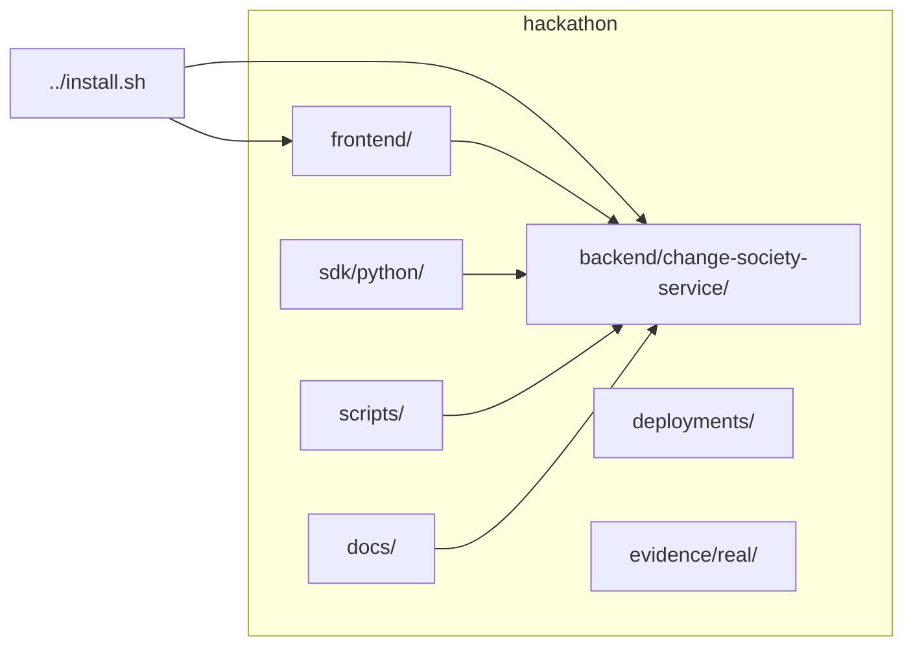
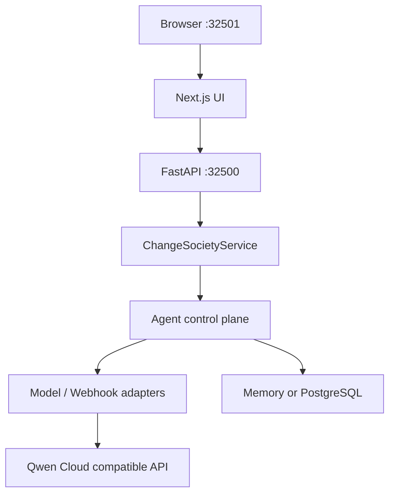

# Change Society — Hackathon Pack

Public GitHub entry for the **Qwen Cloud Hackathon (Track 3 — Agent Society)** submission.

**Judges:** start at [SUBMISSION.md](SUBMISSION.md).

## Install

From the **repository root** (this folder when cloned from [AgentCore-Hackathon](https://github.com/Sepideh-Asadollahi/AgentCore-Hackathon); or the parent of `hackathon/` in the full AgentCore tree):

```bash
bash install.sh
```

**Python `.venv` (manual):** `requirements.txt` at this level installs API dependencies into `.venv` at the repo root; `requirements-dev.txt` adds pytest for `bash scripts/run-pytest.sh`.

```bash
python3 -m venv .venv
.venv/bin/pip install --upgrade pip
.venv/bin/pip install -r requirements.txt
# optional, for tests:
.venv/bin/pip install -r requirements-dev.txt
```

Or from the full AgentCore monorepo:

```bash
bash hackathon/install.sh --profile verify
```

## Repository layout (Mermaid)



## Runtime stack (Mermaid)



## Docs

| Audience | Start here |
|----------|------------|
| Judges / reviewers | [docs/14-submission-pack-index.md](docs/14-submission-pack-index.md) · **[docs/29-langgraph-sdk-live-seven-scenarios.md](docs/29-langgraph-sdk-live-seven-scenarios.md)** · [docs/28-judge-seven-scenario-live-qwen-smoke.md](docs/28-judge-seven-scenario-live-qwen-smoke.md) |
| Run locally | [docs/01-quickstart.md](docs/01-quickstart.md) |
| Architecture | [docs/02-architecture.md](docs/02-architecture.md) — complete HLD/LLD + Mermaid |
| LangGraph bridge | [docs/11-agent-language-and-langchain-sdk.md](docs/11-agent-language-and-langchain-sdk.md) · [docs/26-external-agent-integrator-guide.md](docs/26-external-agent-integrator-guide.md) · [examples/external-change-analyst-worker](examples/external-change-analyst-worker/README.md) |

Full index: [docs/README.md](docs/README.md).

## Tests

```bash
bash hackathon/scripts/run-pytest.sh -q
```

```bash
node --experimental-strip-types --test tests/frontend/change-society/*.test.mjs
```
