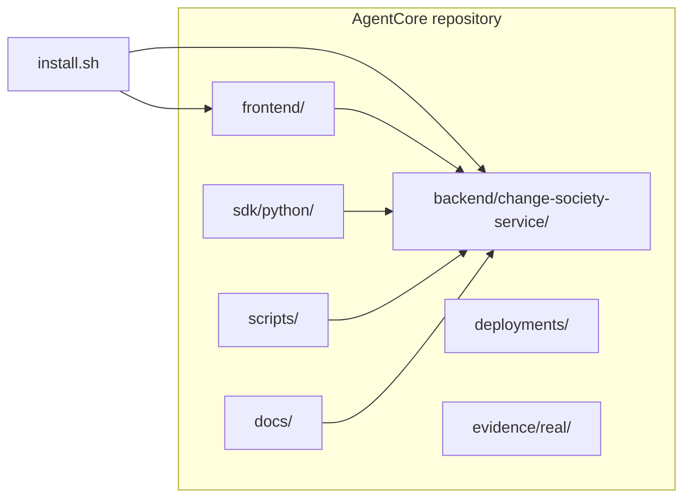
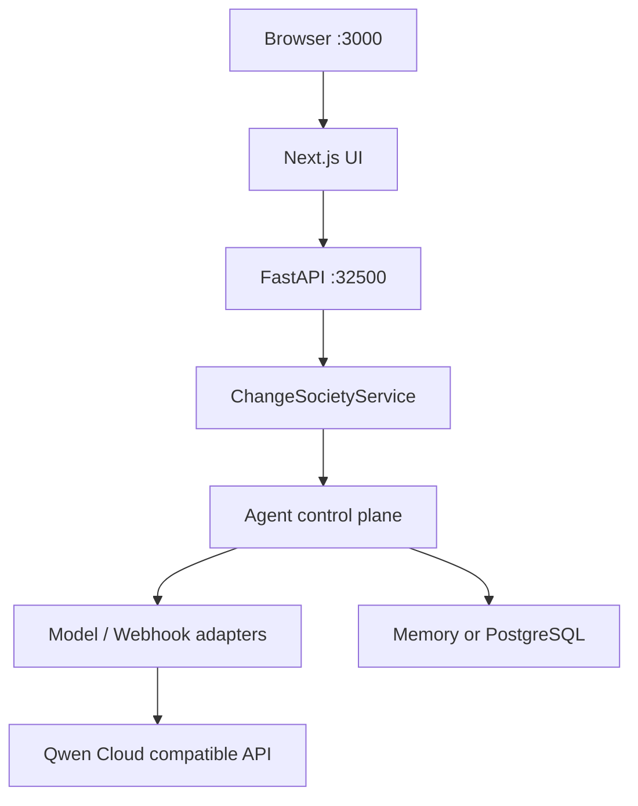

# AgentCore

**Qwen Cloud Hackathon · Track 3 — Agent Society** · reference demo: **Change Society**

Agent control plane for governed multi-agent work. This repository includes the **Change Society** showcase: ambiguous software changes → negotiation, policy evidence, human approval.

**Judges / reviewers:** start at **[docs/14-submission-pack-index.md](docs/14-submission-pack-index.md)** (review path, evidence links, compliance API).

## Install

From the pack root (folder with `install.sh`), or from anywhere via absolute path — paths are resolved from the script location, not your current shell directory.

```bash
bash install.sh
bash install.sh --profile verify   # + deterministic society smoke
```

**Manual Python `.venv`:**

```bash
python3 -m venv .venv
.venv/bin/pip install --upgrade pip
.venv/bin/pip install -r requirements.txt
.venv/bin/pip install -r requirements-dev.txt   # optional: pytest helpers
```

Copy **`.env.example`** → **`.env`** for live Qwen (`QWEN_API_KEY`). A fresh install writes a **demo** `.env` when missing (`fake` model — no API key required for local judging).

Details: [docs/01-quickstart.md](docs/01-quickstart.md).

## Run locally

Two processes: **API** (FastAPI) and **web UI** (Next.js). Copy **`.env.example`** → **`.env`** first so CORS and the UI know the API URL.

| Service | Default port | URL (local) | Purpose |
|---------|--------------|-------------|---------|
| Change Society API | `32500` | [http://127.0.0.1:32500](http://127.0.0.1:32500) | REST + `/health`, `/ready`, `/api/v1/...` |
| Demo web UI | `3000` | [http://localhost:3000](http://localhost:3000) | Cinematic Change Society demo |

**Terminal 1 — API** (from pack root):

```bash
set -a && source .env && set +a
python3 run.py
```

`run.py` listens on **`0.0.0.0:32500`** by default (`CHANGE_SOCIETY_API_HOST`, `CHANGE_SOCIETY_API_PORT` in `.env`). Equivalent manual start:

```bash
PYTHONPATH=backend/change-society-service/src .venv/bin/python -m uvicorn change_society.main:app --host 0.0.0.0 --port 32500
```

**Terminal 2 — web UI**:

```bash
cd frontend && npm run dev
```

Open [http://localhost:3000](http://localhost:3000).

### Connect from another machine (same LAN / VM)

1. Start the API with `CHANGE_SOCIETY_API_HOST=0.0.0.0` (default in `run.py`).
2. In `.env`, set **`NEXT_PUBLIC_CHANGE_SOCIETY_API_URL`** to the host IP the **browser** can reach, e.g. `http://192.168.1.10:32500` (not `127.0.0.1` if the UI is opened on another PC).
3. Add that UI origin to **`CHANGE_SOCIETY_ALLOWED_ORIGINS`** (comma-separated), e.g. `http://localhost:3000,http://192.168.1.10:3000`.
4. Rebuild or restart the UI after changing `NEXT_PUBLIC_*` vars (`npm run dev` picks them up on restart).
5. Open firewall/security groups for **TCP 3000** (web) and **32500** (API) if needed.

### Sanity checks

```bash
curl -sS http://127.0.0.1:32500/health
curl -sS http://127.0.0.1:32500/ready
curl -sS http://127.0.0.1:32500/api/v1/hackathon/submission-compliance | jq .
```

## Repository layout



## Runtime stack



## Documentation

| Audience | Start here |
|----------|------------|
| Judges | [docs/14-submission-pack-index.md](docs/14-submission-pack-index.md) · [docs/27-judge-live-and-real-test-evidence.md](docs/27-judge-live-and-real-test-evidence.md) · [docs/29-langgraph-sdk-live-seven-scenarios.md](docs/29-langgraph-sdk-live-seven-scenarios.md) |
| Architecture | [docs/02-architecture.md](docs/02-architecture.md) |
| Pitch / demo | [docs/25-pitch-and-demo-focus.md](docs/25-pitch-and-demo-focus.md) |
| Org policy intake | [docs/30-org-policy-intake-slice.md](docs/30-org-policy-intake-slice.md) |
| LangGraph integrator | [docs/26-external-agent-integrator-guide.md](docs/26-external-agent-integrator-guide.md) · [examples/external-change-analyst-worker](examples/external-change-analyst-worker/README.md) |

Full index: [docs/README.md](docs/README.md).

## Tests and evidence

```bash
bash scripts/run-pytest.sh -q
bash scripts/run-frontend-tests.sh
bash scripts/run-real-test.sh
bash scripts/run-real-test-suite.sh
```

UI helpers (when a `tests/frontend/change-society/` tree exists in your checkout):

```bash
bash scripts/run-frontend-tests.sh
# or: cd frontend && npm test
```

See [docs/06-testing-and-evaluation.md](docs/06-testing-and-evaluation.md) and [evidence/README.md](evidence/README.md).

## License

Apache-2.0 — see `LICENSE` in this repository.
