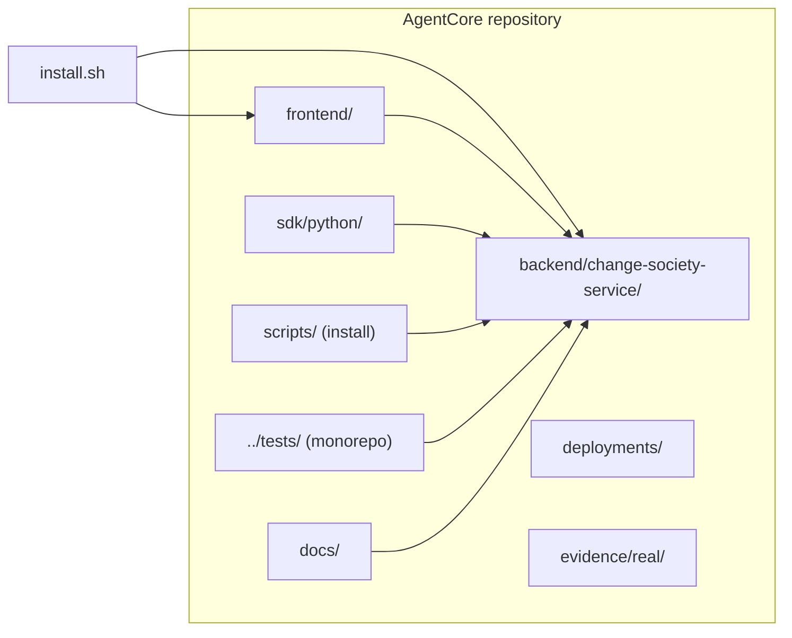
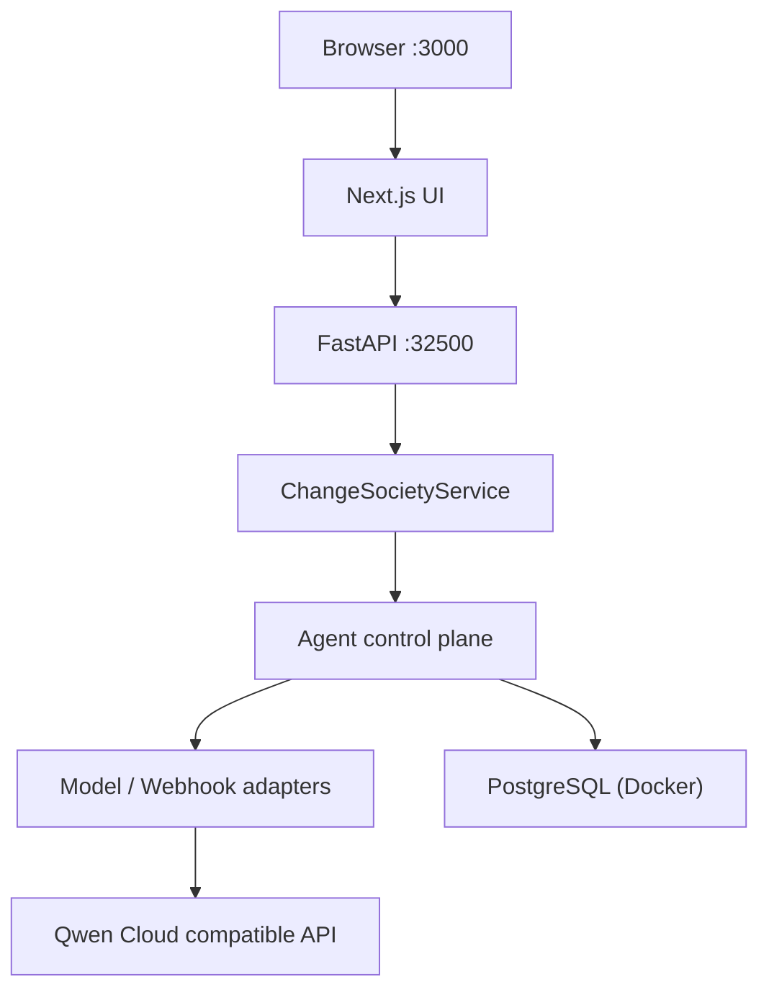

# AgentCore

**Qwen Cloud Hackathon · Track 3 — Agent Society** · reference demo: **Change Society**

Agent control plane for governed multi-agent work. This repository includes the **Change Society** showcase: ambiguous software changes → negotiation, policy evidence, human approval.

**Judges / reviewers:** start at **[docs/14-submission-pack-index.md](docs/14-submission-pack-index.md)** (review path, evidence links, compliance API).

### Judges — where important information lives

| If you need… | Go here |
|--------------|---------|
| **What to click in the demo UI** (pages, run tabs, Settings, progress dialog) | **[frontend/docs/web-interface-guide.md](frontend/docs/web-interface-guide.md)** |
| **Full submission checklist & doc map** | [docs/14-submission-pack-index.md](docs/14-submission-pack-index.md) |
| **Executed live / real test proof** (commands + artifacts) | [docs/27-judge-live-and-real-test-evidence.md](docs/27-judge-live-and-real-test-evidence.md) · [docs/29-langgraph-sdk-live-seven-scenarios.md](docs/29-langgraph-sdk-live-seven-scenarios.md) |
| **Install & public URL / systemd ports** | This README (Install + Run locally) · [docs/01-quickstart.md](docs/01-quickstart.md) |
| **Architecture & Qwen integration** | [docs/02-architecture.md](docs/02-architecture.md) · [docs/03-qwen-cloud-integration.md](docs/03-qwen-cloud-integration.md) |
| **Claims → evidence mapping** | [docs/16-claim-evidence-mapping.md](docs/16-claim-evidence-mapping.md) |
| **Machine-readable compliance** | `curl -sS http://<host>:32500/api/v1/hackathon/submission-compliance` |
| **LangGraph external worker** | [docs/26-external-agent-integrator-guide.md](docs/26-external-agent-integrator-guide.md) · `examples/external-change-analyst-worker/` |

**Suggested UI path for a 5-minute review:** open **Run** → start one scenario → when the progress dialog finishes, **Open Work queue** → tab **Guide** → **Agent Story** (Mermaid map) → **Work Queue** (tickets) → **Review** → **Results**.

## Install

From the pack root (folder with `install.sh`), or from anywhere via absolute path — paths are resolved from the script location, not your current shell directory.

**Recommended (fresh VM / judge machine — OS prerequisites + app + Docker PostgreSQL):**

```bash
bash install.sh --non-interactive --install-os-deps
```

**Recommended server / always-on demo (systemd user units — LangGraph worker + API + production UI):**

```bash
bash install.sh --non-interactive --install-os-deps --systemd
```

Same as `--runtime systemd` after install. Units: `change-society-langgraph-worker`, `change-society-api`, `change-society-web` under `~/.config/systemd/user/`. UI listens on **`CHANGE_SOCIETY_WEB_PORT`** (default **32501**, `npm run start` binds **`0.0.0.0`**).

**Keep services running after logout / reboot:**

```bash
bash scripts/ensure-systemd-stack.sh    # postgres (Docker) + API + UI + worker + linger
```

If the UI shows **`API returned non-JSON (500)`** on `/demo-scenarios`, the API is usually down because **PostgreSQL (Docker) stopped**. Check `docker ps` for `change-society-dev-postgres`, then `systemctl --user restart change-society-postgres.service change-society-api.service`.

**Public IP demo** (replace with your VM address; opens UI to browsers on the internet):

```bash
bash scripts/configure-public-demo-host.sh 203.0.113.50
bash install.sh --non-interactive --systemd   # rebuild UI if NEXT_PUBLIC_* changed
bash scripts/ensure-systemd-stack.sh
```

Open **TCP** on the host / security group: **`32501`** (UI), **`32500`** (API curl / judges), optional **`32510`** (worker health). PostgreSQL stays on **`32232`** (localhost / Docker only).

| Port | Service |
|------|---------|
| **32500** | Change Society API (`/health`, `/ready`, `/api/v1/...`) |
| **32501** | Production web UI (systemd; override with `CHANGE_SOCIETY_WEB_PORT=3200` in `.env` if you expose **3200** instead) |
| **32510** | LangGraph webhook worker (`/ready`) |
| **32232** | PostgreSQL (Docker, not public) |

**OS prerequisites only** (Python 3.12, Node/npm, Docker + Compose v2, curl, git — Debian/Ubuntu via `apt`; then run full install above):

```bash
bash install.sh --prerequisites-only
```

Other profiles:

```bash
bash install.sh
bash install.sh --profile verify   # + live Qwen society smoke (one scenario)
```

Copy **`.env.example`** → **`.env`** for live Qwen (`QWEN_API_KEY`). **`install.sh` syncs a minimum boot `.env` from `.env.example` on every run** (preserves a non-empty `QWEN_API_KEY` and Postgres password). **`CHANGE_SOCIETY_STORE=postgresql`** — install starts **PostgreSQL 16 in Docker** and applies SQL migrations.

Details: [docs/01-quickstart.md](docs/01-quickstart.md).

### Manual install — prerequisites

Install these **before** the manual Python/npm steps below, or use `bash install.sh --install-os-deps` to install them on Debian/Ubuntu.

| Prerequisite | Required | Version / notes | Debian/Ubuntu (example) | Verify |
|--------------|----------|-----------------|-------------------------|--------|
| **Python** | yes | **3.12+** with `venv` | `sudo apt install python3.12 python3.12-venv` (Ubuntu 22.04: `install.sh --install-os-deps` may add deadsnakes PPA) | `python3.12 --version` |
| **pip** | yes | via project `.venv` | created by installer / `python3.12 -m venv .venv` | `.venv/bin/pip --version` |
| **Node.js** | yes (UI) | **20+** recommended (18 minimum) | `sudo apt install nodejs npm` or [Node 20 LTS](https://nodejs.org/) if apt Node is too old | `node --version` |
| **npm** | yes (UI) | matches Node | same as Node | `npm --version` |
| **Docker Engine** | yes | for PostgreSQL | `sudo apt install docker.io` + `sudo systemctl enable --now docker` | `docker info` |
| **Docker Compose** | yes | **v2 plugin** (`docker compose`) | `sudo apt install docker-compose-v2` | `docker compose version` |
| **PostgreSQL** | yes (runtime) | **16** via Docker (not host packages) | started by `install.sh` (`deployments/compose.dev-postgres.yaml`) | `docker ps` shows `change-society-dev-postgres` |
| **curl** | yes | health / smoke checks | `sudo apt install curl ca-certificates` | `curl --version` |
| **git** | yes (clone) | any recent | `sudo apt install git` | `git --version` |
| **QWEN_API_KEY** | live demos | Qwen Cloud API key | set in `.env` (not committed) | `python scripts/qwen_hello_smoke.py` |
| **jq** | optional | README sanity examples | `sudo apt install jq` | `jq --version` |

**Manual Python `.venv`** (after prerequisites):

```bash
python3.12 -m venv .venv
.venv/bin/pip install --upgrade pip
.venv/bin/pip install -r requirements.txt
.venv/bin/pip install -r requirements-dev.txt   # optional: pytest helpers
cp .env.example .env   # edit QWEN_API_KEY, postgres URLs if needed
bash install.sh --non-interactive --skip-frontend   # still runs Docker Postgres + migrations if Docker is up
```

Or start PostgreSQL yourself:

```bash
docker compose --env-file .env -f deployments/compose.dev-postgres.yaml up -d
.venv/bin/python scripts/apply_change_society_migrations.py --wait
```

## Run locally

Two processes: **API** (FastAPI) and **web UI** (Next.js). Copy **`.env.example`** → **`.env`** first so CORS and the UI know the API URL.

| Service | Default port | URL (local) | Purpose |
|---------|--------------|-------------|---------|
| Change Society API | `32500` | [http://127.0.0.1:32500](http://127.0.0.1:32500) | REST + `/health`, `/ready`, `/api/v1/...` |
| Demo web UI (dev) | `32501` | [http://localhost:32501](http://localhost:32501) | `cd frontend && npm run dev` |
| Demo web UI (systemd) | `32501` (or `CHANGE_SOCIETY_WEB_PORT`) | [http://127.0.0.1:32501](http://127.0.0.1:32501) | `npm run start` via `change-society-web.service` |

**Terminal 1 — API** (from pack root):

```bash
set -a && source .env && set +a
python3 run.py
```

`run.py` listens on **`0.0.0.0:32500`** by default (`CHANGE_SOCIETY_API_HOST`, `CHANGE_SOCIETY_API_PORT` in `.env`). Equivalent manual start:

```bash
PYTHONPATH=backend/change-society-service/src .venv/bin/python -m uvicorn change_society.main:app --host 0.0.0.0 --port 32500
```

**Terminal 2 — web UI**:

```bash
cd frontend && npm run dev
```

Open [http://localhost:32501](http://localhost:32501) (or `npm run dev` default port).

### Public server (systemd, judges / internet)

1. Install with **`bash install.sh --non-interactive --install-os-deps --systemd`**.
2. Set **`QWEN_API_KEY`** in **`.env`** for live LangGraph agents.
3. **`bash scripts/configure-public-demo-host.sh YOUR_PUBLIC_IP`**
4. **`bash scripts/ensure-systemd-stack.sh`** — enables units and **`loginctl enable-linger`** so services stay up after SSH logout.
5. Firewall / cloud security group: allow **32501** (UI), **32500** (API). Worker **32510** is optional (health checks only).
6. Browser: **`http://YOUR_PUBLIC_IP:32501/`** — API is proxied same-origin (`/change-society-api` → `127.0.0.1:32500`).

Sanity from your laptop:

```bash
curl -sS "http://YOUR_PUBLIC_IP:32500/health"
curl -sS "http://YOUR_PUBLIC_IP:32501/" | head -c 200
```

### Connect from another machine (same LAN / VM)

1. Start the API with `CHANGE_SOCIETY_API_HOST=0.0.0.0` (default in `run.py`).
2. In `.env`, set **`NEXT_PUBLIC_CHANGE_SOCIETY_API_URL`** to the host IP the **browser** can reach, e.g. `http://192.168.1.10:32500` (not `127.0.0.1` if the UI is opened on another PC).
3. Add that UI origin to **`CHANGE_SOCIETY_ALLOWED_ORIGINS`** (comma-separated), e.g. `http://localhost:3000,http://192.168.1.10:3000`.
4. Rebuild or restart the UI after changing `NEXT_PUBLIC_*` vars (`npm run dev` picks them up on restart).
5. Open firewall/security groups for **TCP 32501** (web) and **32500** (API) if needed.

### Sanity checks

```bash
curl -sS http://127.0.0.1:32500/health
curl -sS http://127.0.0.1:32500/ready
curl -sS http://127.0.0.1:32500/api/v1/hackathon/submission-compliance | jq .
```

## Repository layout



## Runtime stack



## Documentation

| Audience | Start here |
|----------|------------|
| Judges | [docs/14-submission-pack-index.md](docs/14-submission-pack-index.md) · **[frontend/docs/web-interface-guide.md](frontend/docs/web-interface-guide.md)** (UI walkthrough) · [docs/27-judge-live-and-real-test-evidence.md](docs/27-judge-live-and-real-test-evidence.md) · [docs/29-langgraph-sdk-live-seven-scenarios.md](docs/29-langgraph-sdk-live-seven-scenarios.md) |
| Architecture | [docs/02-architecture.md](docs/02-architecture.md) |
| Pitch / demo | [docs/25-pitch-and-demo-focus.md](docs/25-pitch-and-demo-focus.md) |
| Org policy intake | [docs/30-org-policy-intake-slice.md](docs/30-org-policy-intake-slice.md) |
| LangGraph integrator | [docs/26-external-agent-integrator-guide.md](docs/26-external-agent-integrator-guide.md) · [examples/external-change-analyst-worker](examples/external-change-analyst-worker/README.md) |

Full index: [docs/README.md](docs/README.md).

## Tests and evidence

```bash
bash ../tests/backend/change-society-service/run-pytest.sh -q
bash ../tests/frontend/change-society/run-frontend-tests.sh
bash ../tests/e2e/change-society/run-real-test.sh
bash ../tests/e2e/change-society/run-real-test-suite.sh
```

UI helpers (when a `tests/frontend/change-society/` tree exists in your checkout):

```bash
bash ../tests/frontend/change-society/run-frontend-tests.sh
# or: cd frontend && npm test
```

See [docs/06-testing-and-evaluation.md](docs/06-testing-and-evaluation.md) and [evidence/README.md](evidence/README.md).

## License

Apache-2.0 — see `LICENSE` in this repository.
