# Change Society — Architecture (HLD + LLD)

This document describes the **AgentCore Agent Control Plane — Change Society Demo** architecture implemented under `hackathon/backend/change-society-service/`. It is the authoritative hackathon architecture reference for reviewers and contributors.

Related documents:

- [10-agent-control-plane-boundary.md](10-agent-control-plane-boundary.md) — product boundary and Track 3 proof points  
- [03-qwen-cloud-integration.md](03-qwen-cloud-integration.md) — Qwen adapter behavior  
- [04-protocol-and-sdk.md](04-protocol-and-sdk.md) — Universal Agent JSON and clients  
- [11-agent-language-and-langchain-sdk.md](11-agent-language-and-langchain-sdk.md) — LangChain / LangGraph external workers  
- [23-multi-vendor-agent-network-ecosystem.md](23-multi-vendor-agent-network-ecosystem.md) — multi-vendor network ecosystem and demo mapping  
- [../../docs/05-interoperability-ecosystem/09-multi-vendor-agent-network-ecosystem.md](../../docs/05-interoperability-ecosystem/09-multi-vendor-agent-network-ecosystem.md) — canonical platform vision (layers, federation, broker)  

---

## 1. Architectural goals

| Goal | Mechanism |
|------|-----------|
| Vendor-neutral control plane | External agents via **ManagedAgent** registry + **AgentAdapter** (model or signed webhook) |
| Deterministic governance | Domain **policies** (conflict, approval) override model suggestions |
| Auditability | **Durable AgentTicket** lifecycle + immutable **Universal Agent JSON** messages |
| Testability | Injected **ports** (model, repositories, clock, ids); fake model + in-memory stores |
| Production shape | PostgreSQL persistence, Qwen Cloud adapter, configurable budgets and retries |
| Project isolation | **Scope** (`tenant_id`, `workspace_id`, `project_id`) on every run and ticket |

---

## 2. System context

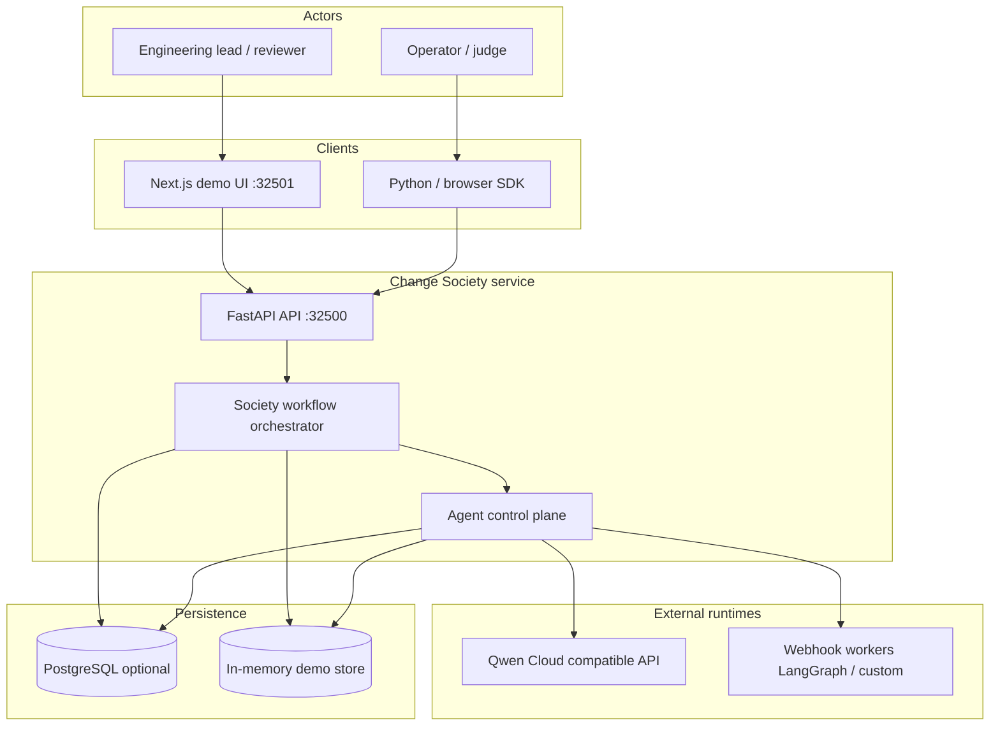
```mermaid
flowchart TB
  subgraph actors [Actors]
    Lead[Engineering lead / reviewer]
    Ops[Operator / judge]
  end

  subgraph agentcore [Change Society service]
    API[FastAPI API :32500]
    CP[Agent control plane]
    SW[Society workflow orchestrator]
    API --> SW
    SW --> CP
  end

  subgraph clients [Clients]
    UI[Next.js demo UI :32501]
    SDK[Python / browser SDK]
  end

  subgraph external [External runtimes]
    Qwen[Qwen Cloud compatible API]
    WH[Webhook workers LangGraph / custom]
  end

  subgraph data [Persistence]
    PG[(PostgreSQL optional)]
    MEM[(In-memory demo store)]
  end

  Lead --> UI
  Ops --> SDK
  UI --> API
  SDK --> API
  CP --> Qwen
  CP --> WH
  SW --> PG
  SW --> MEM
  CP --> PG
  CP --> MEM
```

**Boundary rule:** AgentCore orchestrates tickets, messages, and policy. **LLM reasoning and private agent loops live in external workers** (Qwen-backed model adapters or webhook services).

---

## 3. Container view (deployment)

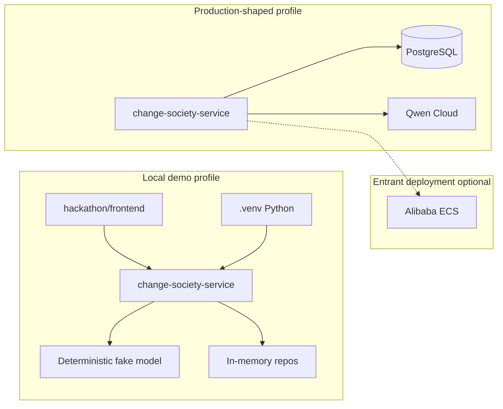
```mermaid
flowchart LR
  subgraph local_demo [Local demo profile]
    FE[hackathon/frontend]
    BE[change-society-service]
    VENV[.venv Python]
    FE --> BE
    VENV --> BE
    BE --> FAKE[Deterministic fake model]
    BE --> IMEM[In-memory repos]
  end

  subgraph production_shape [Production-shaped profile]
    BE2[change-society-service]
    PG2[(PostgreSQL)]
    QW2[Qwen Cloud]
    BE2 --> PG2
    BE2 --> QW2
  end

  subgraph alibaba [Entrant deployment optional]
    ECS[Alibaba ECS]
    BE2 -.-> ECS
  end
```

| Profile | `CHANGE_SOCIETY_MODEL_PROVIDER` | `CHANGE_SOCIETY_STORE` | Purpose |
|---------|-----------------------------------|-------------------------|---------|
| Judged offline demo | `fake` | `memory` | No API keys; deterministic negotiation |
| Live Qwen dev | `qwen` | `memory` | Real model; fast setup |
| Production-like | `qwen` | `postgresql` | Durable runs, tickets, idempotency |

---

## 4. Repository and module map

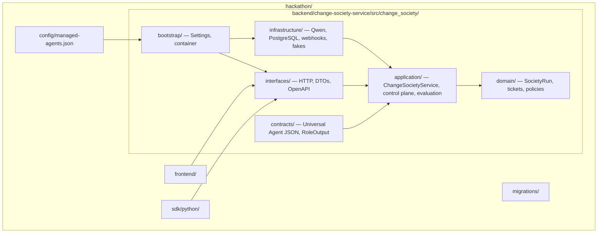
```mermaid
flowchart TB
  subgraph hackathon [hackathon/]
    subgraph service [backend/change-society-service/src/change_society/]
      IF[interfaces/ — HTTP, DTOs, OpenAPI]
      APP[application/ — ChangeSocietyService, control plane, evaluation]
      DOM[domain/ — SocietyRun, tickets, policies]
      INF[infrastructure/ — Qwen, PostgreSQL, webhooks, fakes]
      BOOT[bootstrap/ — Settings, container]
      CTR[contracts/ — Universal Agent JSON, RoleOutput]
    end
    CFG[config/managed-agents.json]
    MIG[migrations/]
    FE2[frontend/]
    SDK2[sdk/python/]
  end

  IF --> APP
  APP --> DOM
  INF --> APP
  BOOT --> IF
  BOOT --> INF
  CTR --> APP
  CFG --> BOOT
  FE2 --> IF
  SDK2 --> IF
```

### Layer responsibilities

| Layer | Path | Responsibility |
|-------|------|----------------|
| **interfaces** | `interfaces/api.py`, `interfaces/dtos.py` | HTTP transport, header scope, error mapping, OpenAPI |
| **application** | `application/service.py`, `application/control_plane.py` | Society workflow, ticket dispatch, baseline evaluation |
| **domain** | `domain/models.py`, `domain/policies.py`, `domain/control_plane.py` | Invariants, run/ticket state machines, conflict and approval rules |
| **infrastructure** | `infrastructure/qwen_client.py`, `repositories.py`, `agent_adapters.py` | Adapters implementing application **ports** |
| **bootstrap** | `bootstrap/config.py`, `container.py` | Sole composition root; reads environment |
| **contracts** | `contracts/messages.py`, `contracts/agent_adapter.py` | Versioned payloads shared with SDK and workers |

### Dependency rule (strict)

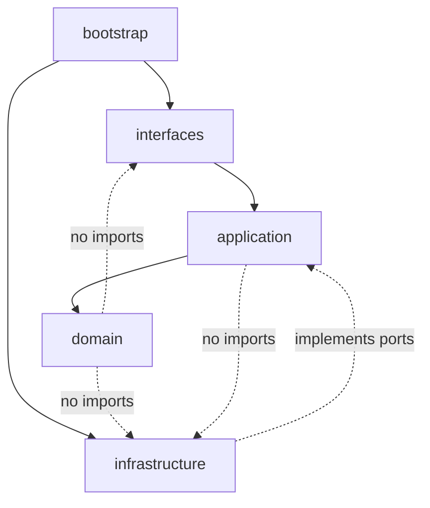
```mermaid
flowchart TD
  IF[interfaces] --> APP[application]
  APP --> DOM[domain]
  INF[infrastructure] -.->|implements ports| APP
  BOOT[bootstrap] --> IF
  BOOT --> INF
  DOM -.->|no imports| INF
  DOM -.->|no imports| IF
  APP -.->|no imports| INF
```

Domain and application **must not** import FastAPI, httpx, psycopg, or `os.environ`. Only **bootstrap** wires concrete implementations.

---

## 5. Control plane components

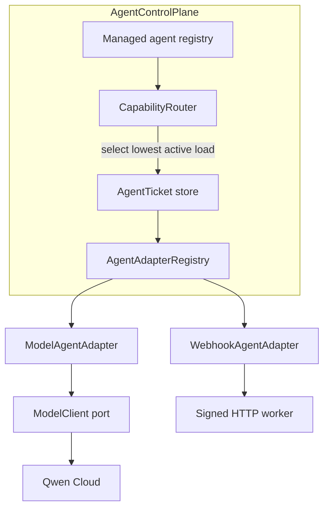
```mermaid
flowchart TB
  subgraph control_plane [AgentControlPlane]
    REG[Managed agent registry]
    RTR[CapabilityRouter]
    TSTORE[AgentTicket store]
    ADREG[AgentAdapterRegistry]
  end

  REG --> RTR
  RTR -->|select lowest active load| TSTORE
  TSTORE --> ADREG
  ADREG --> MA[ModelAgentAdapter]
  ADREG --> WA[WebhookAgentAdapter]
  MA --> MC[ModelClient port]
  WA --> HTTP[Signed HTTP worker]
  MC --> Qwen[Qwen Cloud]
```

### Managed agents (demo configuration)

Five templates from `config/managed-agents.json` are provisioned per project scope on first use:

| Template key | Role | Capability | Adapter |
|--------------|------|------------|---------|
| context-scout | `context_scout` | `retrieve_scoped_project_truth` | model |
| change-analyst | `change_analyst` | `interpret_ambiguous_software_change` | model |
| impact-analyst | `impact_analyst` | `analyze_cross_boundary_impact` | model |
| policy-guardian | `policy_guardian` | `evaluate_policy_and_approval_risk` | model |
| conflict-judge | `coordinator_judge` | `decompose_route_reconcile` | model |

**Routing:** `CapabilityRouter.select` chooses the eligible **online** agent with the **lowest `active_ticket_count`**, then records `capability_match_lowest_active_load` on the ticket event stream.

### Agent ticket lifecycle

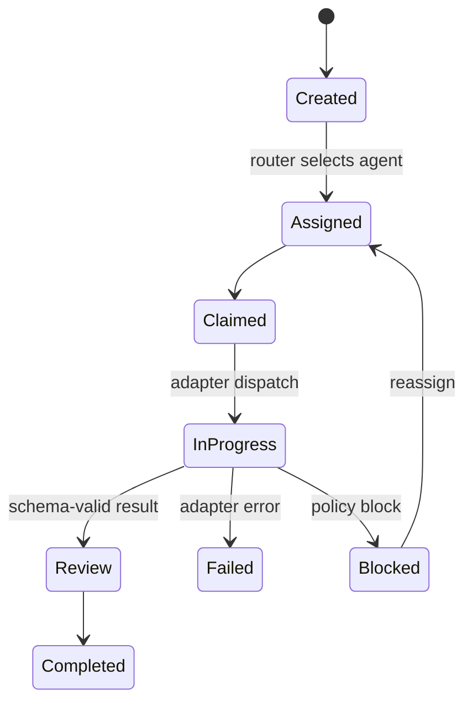
```mermaid
stateDiagram-v2
    [*] --> Created
    Created --> Assigned: router selects agent
    Assigned --> Claimed
    Claimed --> InProgress: adapter dispatch
    InProgress --> Review: schema-valid result
    Review --> Completed
    InProgress --> Failed: adapter error
    InProgress --> Blocked: policy block
    Blocked --> Assigned: reassign
```

Every model call in the society workflow creates one ticket and transitions through **Assigned → Claimed → InProgress → Review → Completed** (visible in API and UI).

---

## 6. Society run state machine

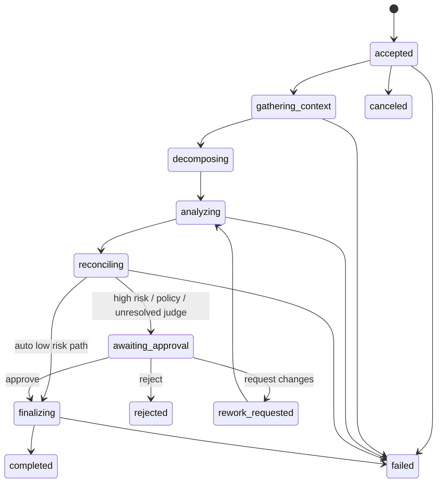
```mermaid
stateDiagram-v2
    [*] --> accepted
    accepted --> gathering_context
    gathering_context --> decomposing
    decomposing --> analyzing
    analyzing --> reconciling
    reconciling --> awaiting_approval: high risk / policy / unresolved judge
    reconciling --> finalizing: auto low risk path
    awaiting_approval --> finalizing: approve
    awaiting_approval --> rejected: reject
    awaiting_approval --> rework_requested: request changes
    rework_requested --> analyzing
    finalizing --> completed
    accepted --> failed
    gathering_context --> failed
    analyzing --> failed
    reconciling --> failed
    finalizing --> failed
    accepted --> canceled
```

States are enforced in `SocietyRun.transition` against `TRANSITIONS` in `domain/models.py`. Invalid transitions raise **conflict_error**.

---

## 7. End-to-end society workflow

### 7.1 Activity overview

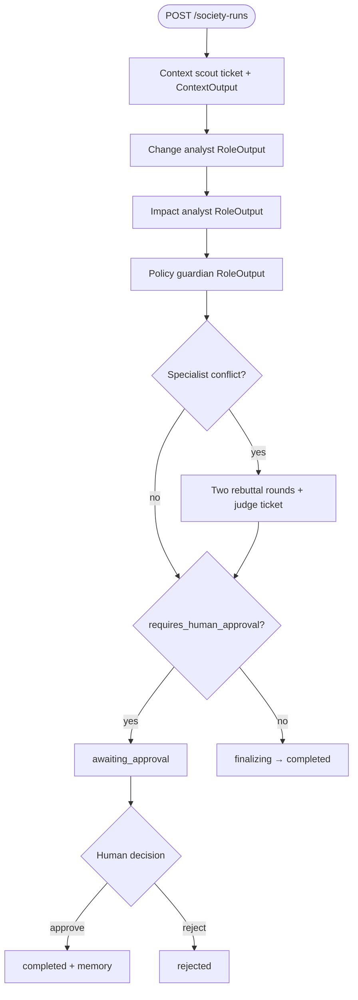
```mermaid
flowchart TD
  START([POST /society-runs]) --> CTX[Context scout ticket + ContextOutput]
  CTX --> CHG[Change analyst RoleOutput]
  CHG --> IMP[Impact analyst RoleOutput]
  IMP --> POL[Policy guardian RoleOutput]
  POL --> REC{Specialist conflict?}
  REC -->|yes| REB[Two rebuttal rounds + judge ticket]
  REC -->|no| APR
  REB --> APR{requires_human_approval?}
  APR -->|yes| WAIT[awaiting_approval]
  APR -->|no| AUTO[finalizing → completed]
  WAIT --> HUMAN{Human decision}
  HUMAN -->|approve| DONE[completed + memory]
  HUMAN -->|reject| REJ[rejected]
```

### 7.2 Sequence (happy path with negotiation)

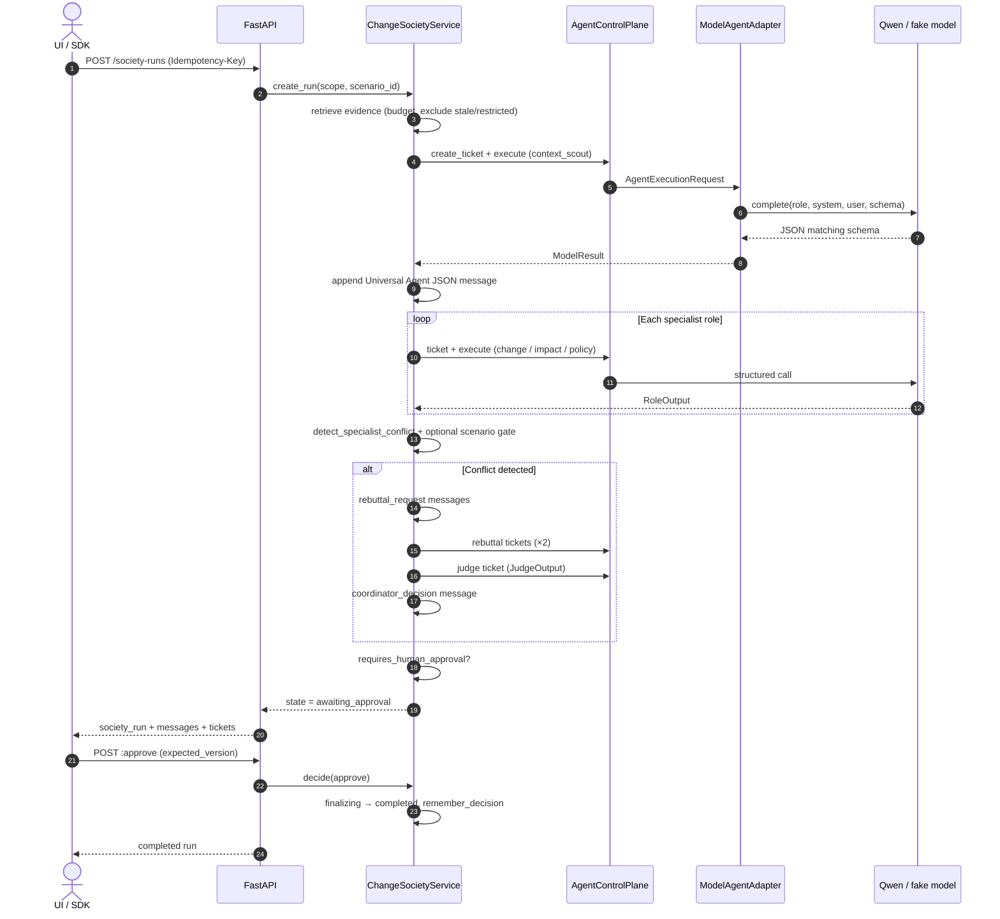
```mermaid
sequenceDiagram
  autonumber
  actor Client as UI / SDK
  participant API as FastAPI
  participant SVC as ChangeSocietyService
  participant CP as AgentControlPlane
  participant AD as ModelAgentAdapter
  participant QW as Qwen / fake model

  Client->>API: POST /society-runs (Idempotency-Key)
  API->>SVC: create_run(scope, scenario_id)
  SVC->>SVC: retrieve evidence (budget, exclude stale/restricted)
  SVC->>CP: create_ticket + execute (context_scout)
  CP->>AD: AgentExecutionRequest
  AD->>QW: complete(role, system, user, schema)
  QW-->>AD: JSON matching schema
  AD-->>SVC: ModelResult
  SVC->>SVC: append Universal Agent JSON message

  loop Each specialist role
    SVC->>CP: ticket + execute (change / impact / policy)
    CP->>QW: structured call
    QW-->>SVC: RoleOutput
  end

  SVC->>SVC: detect_specialist_conflict + optional scenario gate
  alt Conflict detected
    SVC->>SVC: rebuttal_request messages
    SVC->>CP: rebuttal tickets (×2)
    SVC->>CP: judge ticket (JudgeOutput)
    SVC->>SVC: coordinator_decision message
  end

  SVC->>SVC: requires_human_approval?
  SVC-->>API: state = awaiting_approval
  API-->>Client: society_run + messages + tickets

  Client->>API: POST :approve (expected_version)
  API->>SVC: decide(approve)
  SVC->>SVC: finalizing → completed, remember_decision
  API-->>Client: completed run
```

### 7.3 Conflict detection (domain policy)

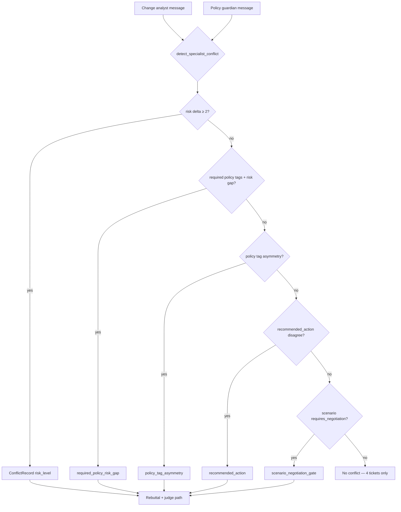
```mermaid
flowchart TD
  A[Change analyst message] --> D{detect_specialist_conflict}
  B[Policy guardian message] --> D
  D --> R1{risk delta ≥ 2?}
  R1 -->|yes| C[ConflictRecord risk_level]
  R1 -->|no| R2{required policy tags + risk gap?}
  R2 -->|yes| C2[required_policy_risk_gap]
  R2 -->|no| R3{policy tag asymmetry?}
  R3 -->|yes| C3[policy_tag_asymmetry]
  R3 -->|no| R4{recommended_action disagree?}
  R4 -->|yes| C4[recommended_action]
  R4 -->|no| G{scenario requires_negotiation?}
  G -->|yes| C5[scenario_negotiation_gate]
  G -->|no| NONE[No conflict — 4 tickets only]
  C --> NEG[Rebuttal + judge path]
  C2 --> NEG
  C3 --> NEG
  C4 --> NEG
  C5 --> NEG
```

Human approval (fail-closed) triggers when:

- final risk is **high** or **critical**,
- judge verdict is **escalate** (unresolved),
- or protected policy tags match (`revenue-impacting-change`, `security-sensitive-change`, etc.).

---

## 8. Universal Agent JSON and contracts

```mermaid
flowchart LR
  subgraph envelope [Universal Agent JSON v1]
    ID[message_id, correlation_id]
    SCOPE[tenant / workspace / project]
    ROLES[sender_role, recipient_role]
    CAP[capability, task_ref]
    PAY[payload + evidence_refs]
    RISK[risk_level, confidence]
  end

  subgraph types [Message types in demo]
    TA[task_assignment]
    SF[specialist_finding]
    RR[rebuttal_request / rebuttal_response]
    CD[coordinator_decision]
    AR[approval_requested / approval_decided]
    RC[run_completed]
  end

  envelope --> types
```

Structured model outputs validate against Pydantic schemas:

- **ContextOutput** — context scout (includes included/excluded evidence)  
- **RoleOutput** — specialists and rebuttals  
- **JudgeOutput** — conflict judge  

The Qwen adapter requests `response_format: json_object` and validates against the schema before any state mutation.

---

## 9. API surface (logical)

```mermaid
flowchart TB
  subgraph ops [Operations]
    H[/health]
    R[/ready]
    SC[/hackathon/submission-compliance]
  end

  subgraph society [change-society]
    CR[POST /society-runs]
    LR[GET /society-runs]
    MSG[GET .../agent-messages]
    CF[GET .../conflicts]
    AP[POST ...:approve | :reject | :request-changes]
    EV[POST ...:evaluate-baseline]
    EA[POST ...:evaluate-all-scenarios]
  end

  subgraph ac [agent-control]
    MA[GET /managed-agents]
    HB[POST ...:heartbeat]
    ST[POST ...:set-state]
    TK[GET /agent-tickets]
  end

  subgraph demo [demo]
    DS[GET /demo-scenarios]
  end
```

All project routes live under `/api/v1/projects/{project_id}/…`. Headers: `X-Tenant-Id`, `X-Workspace-Id`, `X-Actor-Id`, `X-Correlation-Id`, `Idempotency-Key` on commands.

---

## 10. Data persistence

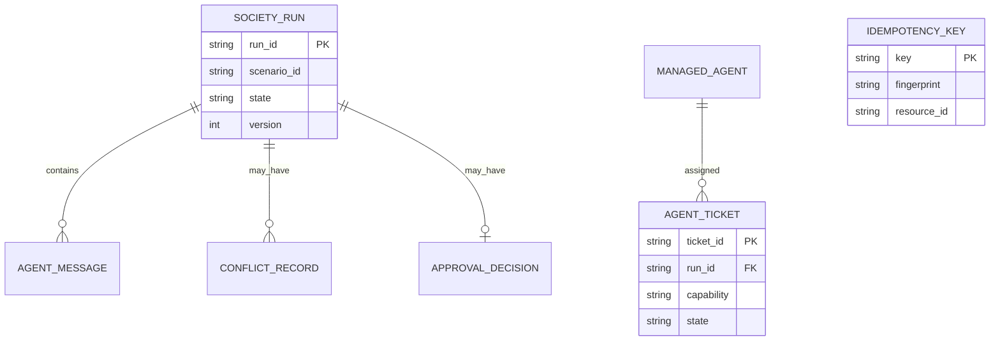
```mermaid
erDiagram
  SOCIETY_RUN ||--o{ AGENT_MESSAGE : contains
  SOCIETY_RUN ||--o{ CONFLICT_RECORD : may_have
  SOCIETY_RUN ||--o| APPROVAL_DECISION : may_have
  SOCIETY_RUN {
    string run_id PK
    string scenario_id
    string state
    int version
  }
  MANAGED_AGENT ||--o{ AGENT_TICKET : assigned
  AGENT_TICKET {
    string ticket_id PK
    string run_id FK
    string capability
    string state
  }
  IDEMPOTENCY_KEY {
    string key PK
    string fingerprint
    string resource_id
  }
```

| Port | Demo implementation | Production implementation |
|------|---------------------|---------------------------|
| `RunRepository` | `InMemoryRunRepository` | `PostgresRunRepository` |
| `ControlPlaneRepository` | `InMemoryControlPlaneRepository` | `PostgresControlPlaneRepository` |
| `EvidenceProvider` | `ScenarioEvidenceProvider` (in-memory catalog + scoped memory) | same interface; catalog static in hackathon |

SQL migrations: `hackathon/backend/change-society-service/migrations/`.

---

## 11. Qwen integration (adapter)

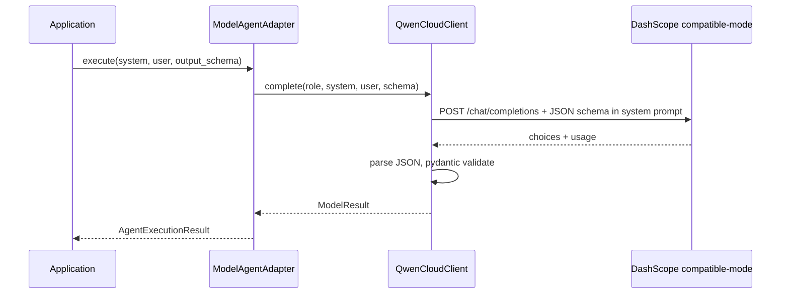
```mermaid
sequenceDiagram
  participant APP as Application
  participant MA as ModelAgentAdapter
  participant QC as QwenCloudClient
  participant API as DashScope compatible-mode

  APP->>MA: execute(system, user, output_schema)
  MA->>QC: complete(role, system, user, schema)
  QC->>API: POST /chat/completions + JSON schema in system prompt
  API-->>QC: choices + usage
  QC->>QC: parse JSON, pydantic validate
  QC-->>MA: ModelResult
  MA-->>APP: AgentExecutionResult
```

Cross-cutting controls:

- **BudgetEnforcingModelClient** — optional per-run token ceiling (`CHANGE_SOCIETY_QWEN_RUN_TOKEN_BUDGET`)  
- Bounded retries on timeout / 429 / selected 5xx  
- Typed **DependencyError** codes (`qwen_authentication_failed`, `qwen_quota_exhausted`, `qwen_schema_invalid`, …)  

---

## 12. External workers (webhook + LangGraph)

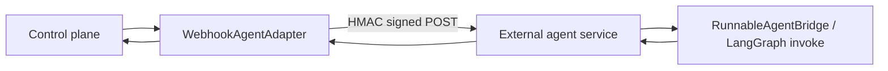
```mermaid
flowchart LR
  CP[Control plane] --> WHA[WebhookAgentAdapter]
  WHA -->|HMAC signed POST| EXT[External agent service]
  EXT --> LG[RunnableAgentBridge / LangGraph invoke]
  LG --> EXT
  EXT --> WHA
  WHA --> CP
```

SDK support: `agentcore_agent_sdk.RunnableAgentBridge`, `SignedWebhookWorker`, translators in [11-agent-language-and-langchain-sdk.md](11-agent-language-and-langchain-sdk.md). Domain logic is unchanged when swapping model adapters for webhooks.

---

## 13. Frontend architecture

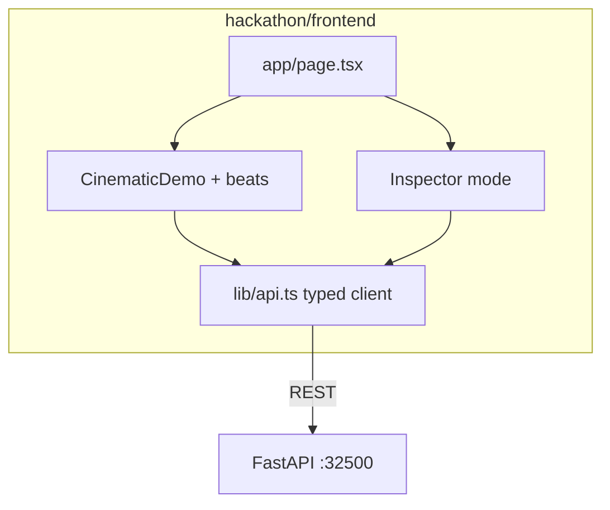
```mermaid
flowchart TB
  subgraph next [hackathon/frontend]
    PAGE[app/page.tsx]
    CIN[CinematicDemo + beats]
    INS[Inspector mode]
    API_LIB[lib/api.ts typed client]
  end

  PAGE --> CIN
  PAGE --> INS
  CIN --> API_LIB
  INS --> API_LIB
  API_LIB -->|REST| BE[FastAPI :32500]
```

Environment: `NEXT_PUBLIC_CHANGE_SOCIETY_*` for API URL and default scope. Cinematic mode narrates ticket and message progression; inspector mode exposes raw protocol JSON for judges.

---

## 14. Evaluation and evidence

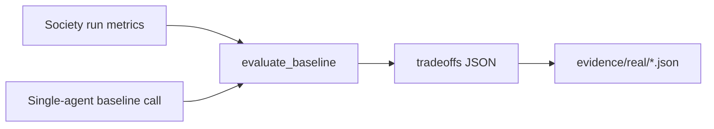
```mermaid
flowchart LR
  RUN[Society run metrics] --> CMP[evaluate_baseline]
  BASE[Single-agent baseline call] --> CMP
  CMP --> OUT[tradeoffs JSON]
  OUT --> ART[evidence/real/*.json]
```

Fixed scenarios (`pricing-refactor`, `password-migration`, `payment-memory`) use deterministic scoring in `application/evaluation.py`. Comparisons are **demonstrative**, not statistically significant (stated in API responses and docs).

### 14.1 Org policy intake (hackathon slice)

Guided intake lets an operator describe business process text before a society run. The service infers policy tags, presents auditable challenges, and on activation stores **org-scoped policy evidence** (`org_policy_*`) merged into `retrieve()` for Policy Guardian. Full design: [30-org-policy-intake-slice.md](30-org-policy-intake-slice.md). Platform-scale rule authoring remains in `docs/04-rule-engine-orchestration/07-custom-rule-authoring-and-suggestion-workflows.md`.

---

## 15. Security and tenancy

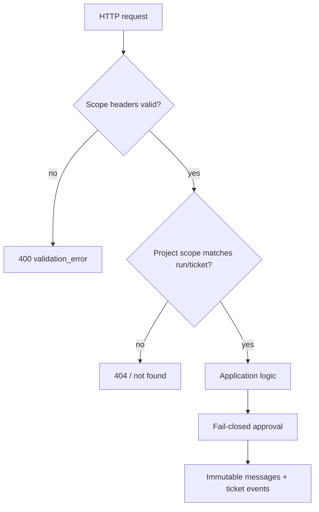
```mermaid
flowchart TD
  REQ[HTTP request] --> HDR{Scope headers valid?}
  HDR -->|no| ERR[400 validation_error]
  HDR -->|yes| ISO{Project scope matches run/ticket?}
  ISO -->|no| NF[404 / not found]
  ISO -->|yes| AUTH[Application logic]
  AUTH --> POL[Fail-closed approval]
  POL --> AUD[Immutable messages + ticket events]
```

- Secrets only via environment (`hackathon/.env`); never in repository or prompts in evidence artifacts.  
- Restricted evidence items are excluded from model context.  
- Idempotency keys deduplicate `create_society_run` and approval commands with fingerprinted payloads.  

See [08-security.md](08-security.md).

---

## 16. Observability

| Signal | Location |
|--------|----------|
| Liveness | `GET /health` |
| Readiness | `GET /ready` (model + store checks) |
| Correlation | `correlation_id` on runs; `X-Correlation-Id` on requests |
| Token usage | Per-message `token_usage`; run metrics aggregate |
| Duration | `model_duration_ms` on society metrics |

---

## 17. Extension points (post-hackathon)

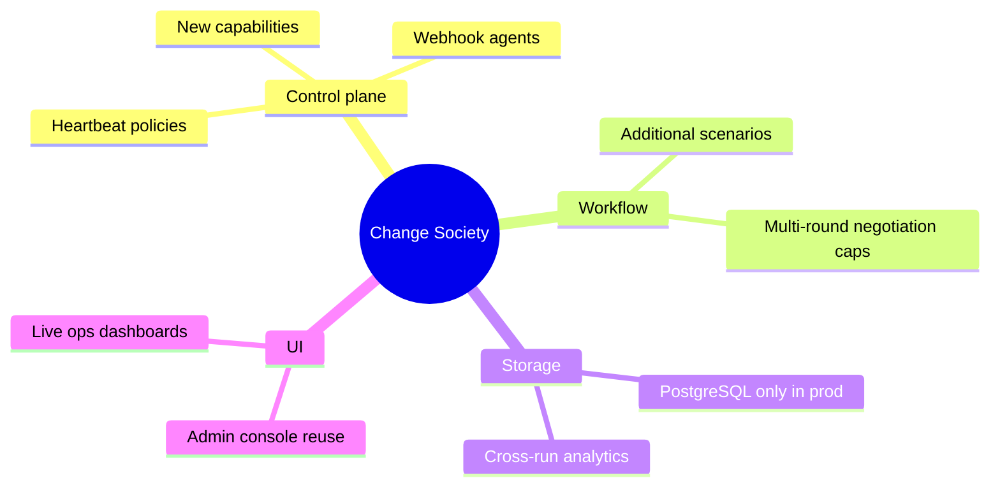
```mermaid
mindmap
  root((Change Society))
    Control plane
      New capabilities
      Webhook agents
      Heartbeat policies
    Workflow
      Additional scenarios
      Multi-round negotiation caps
    Storage
      PostgreSQL only in prod
      Cross-run analytics
    UI
      Admin console reuse
      Live ops dashboards
```

The long-term AgentCore platform (`backend/`, root `docs/`) reuses the same **ports-and-adapters** and **contract-first** patterns described here.

---

## 18. File index (implementation)

| Concern | Primary files |
|---------|----------------|
| Society orchestration | `application/service.py` |
| Control plane | `application/control_plane.py` |
| Policies | `domain/policies.py` |
| Run/ticket models | `domain/models.py`, `domain/control_plane.py` |
| HTTP API | `interfaces/api.py`, `interfaces/dtos.py` |
| Qwen | `infrastructure/qwen_client.py`, `application/qwen_role_tools.py`, `infrastructure/mcp_tool_gateway.py` |
| Judging traceability | `application/judging_engineering_profile.py`, `GET /api/v1/hackathon/judging-engineering-profile` |
| Composition | `bootstrap/container.py`, `bootstrap/config.py` |
| Scenarios | `infrastructure/evidence_catalog.py` |
| SDK | `hackathon/sdk/python/change_society_sdk/`, `agentcore_agent_sdk/` |

---

## 19. Devpost judging criteria → code map

Reviewers can fetch the live map (derived from repository modules, not hand-written claims):

- `GET /api/v1/hackathon/judging-engineering-profile`
- `GET /api/v1/hackathon/submission-compliance` (includes the same profile under `judging_engineering_profile`)

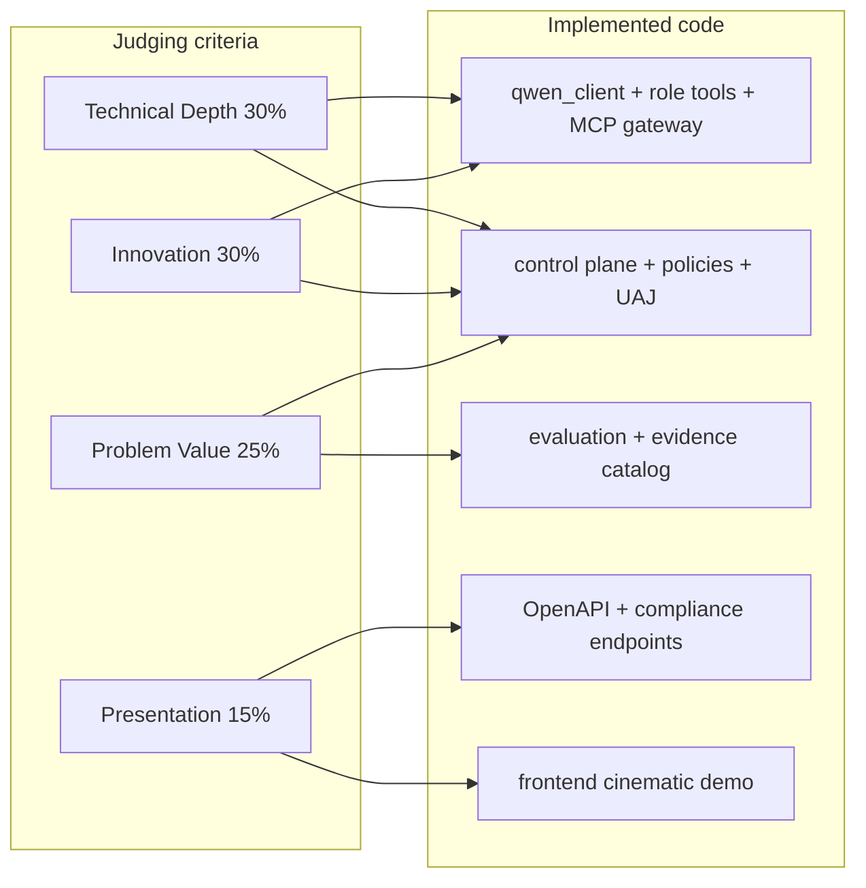
```mermaid
flowchart LR
  subgraph crit [Judging criteria]
    T[Technical Depth 30%]
    I[Innovation 30%]
    V[Problem Value 25%]
    P[Presentation 15%]
  end

  subgraph code [Implemented code]
    QW[qwen_client + role tools + MCP gateway]
    CP[control plane + policies + UAJ]
    EV[evaluation + evidence catalog]
    API[OpenAPI + compliance endpoints]
    UI[frontend cinematic demo]
  end

  T --> QW
  T --> CP
  I --> CP
  I --> QW
  V --> EV
  V --> CP
  P --> API
  P --> UI
```

| Criterion | Weight | Code evidence (examples) |
|-----------|--------|---------------------------|
| Technical Depth & Engineering | 30% | Qwen **tools** loop (`qwen_client.py`), **MCP** gateway (`mcp_tool_gateway.py`), token budget, conflict policies, ranked evidence retrieval |
| Innovation & AI Creativity | 30% | Layered **ports/adapters**, Universal Agent JSON, ticket FSM, LangGraph **RunnableAgentBridge** (SDK), typed errors + idempotency |
| Problem Value & Impact | 25% | Revenue/security **scenarios**, society vs **baseline** metrics, cross-session memory, **webhook** productization path |
| Presentation & Documentation | 15% | **OpenAPI**, demo UI, architecture doc + **HTTP** engineering profile for judges |

---

*Document version: aligned with hackathon backend vertical slice and Track 3 Agent Society demo.*
