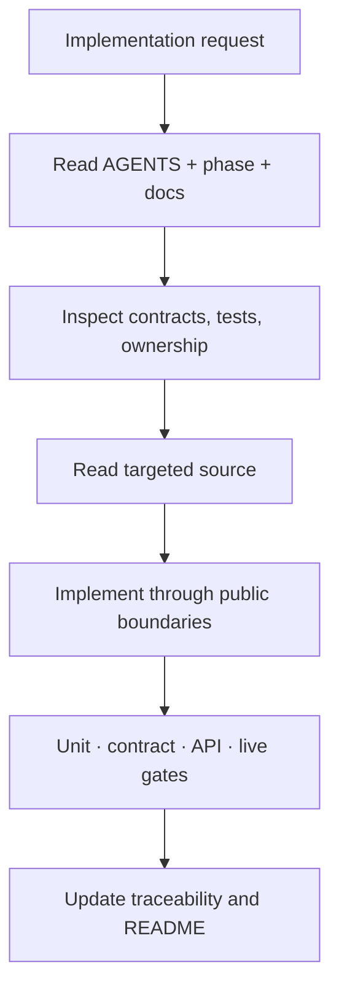

# Agent Workflow for Codex, Cursor, and Other Assistants

This document governs contributor assistants that edit the repository; they are separate from the runtime `ManagedAgent` records in the product. Repository-aware assistants must read `hackathon/AGENTS.md` and the current phase before editing. Cursor receives equivalent rules through `.cursorrules`.

Agents must preserve DI, ports/adapters, PostgreSQL-only runtime persistence, project isolation, versioned protocol compatibility, bounded Qwen calls, evidence references, and human approval. They must never claim deployment or live-provider success without evidence.
