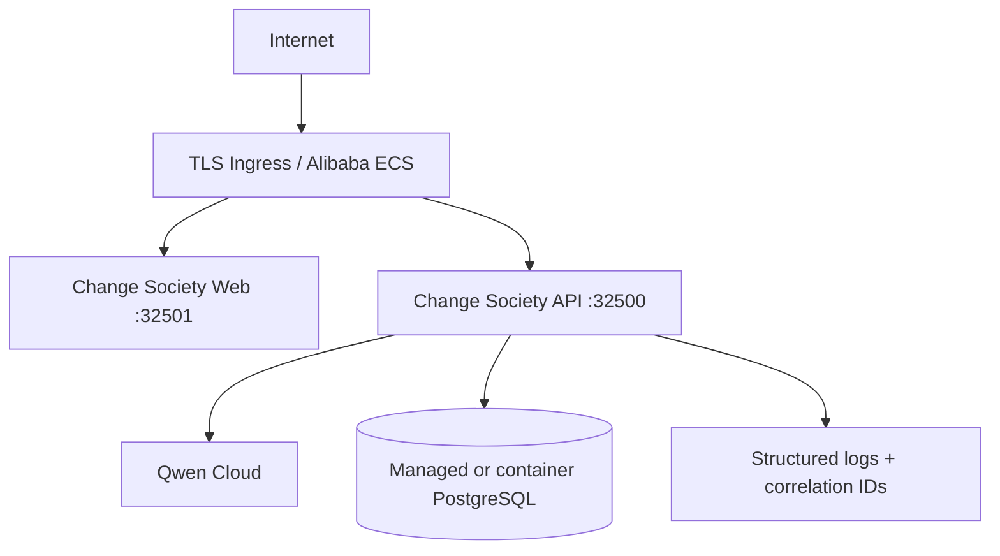

# Deployment and Operations

Local production-shaped infrastructure uses [compose.yaml](compose.yaml). Alibaba Cloud deployment uses the same immutable containers and PostgreSQL migrations. Competition judging requires a **backend running on Alibaba Cloud** plus a **direct repository link** to Alibaba deployment code ([alibaba/deploy-ecs.sh](alibaba/deploy-ecs.sh)).

## Topology



Architecture decision: [alibaba/ADR-001-minimum-topology.md](alibaba/ADR-001-minimum-topology.md).

## Local Compose

From repository root:

```bash
docker compose -f hackathon/deployments/compose.yaml up -d --build
```

Requires entrant `.env` for Qwen and PostgreSQL passwords when using the production profile inside Compose.

Default host ports (configurable): **32500** API, **32501** web — non-default per AgentCore port policy.

## Migrations

Apply on PostgreSQL before or during first production start:

- `hackathon/backend/change-society-service/migrations/0001_change_society.sql`
- `hackathon/backend/change-society-service/migrations/0002_agent_control_plane.sql`

## Health Contract

| Endpoint | Purpose |
|---|---|
| `GET /health` | Process liveness |
| `GET /ready` | Store + model readiness; production requires Qwen + PostgreSQL |

Local fake/memory profile reports **degraded** readiness by design ([01-quickstart.md](../docs/01-quickstart.md)).

## Alibaba ECS Template

See [alibaba/README.md](alibaba/README.md) and `deploy-ecs.sh`. Execution requires `ALIBABA_REGION_ID`, `ALIBABA_ECS_INSTANCE_ID`, and CLI authentication — **entrant-owned**.

## Operations During Judging

Monitoring, rollback, backup, and incident steps: [docs/22-operations-runbook.md](../docs/22-operations-runbook.md).

## Release Smoke

Before tagging a release candidate: [docs/21-release-candidate-and-smoke-checklist.md](../docs/21-release-candidate-and-smoke-checklist.md).

Production requires real Qwen and PostgreSQL profiles. Monitor health/readiness, Qwen errors, token usage, request latency, run failures, approval age, and database health. Preserve the judged release through the judging period.
