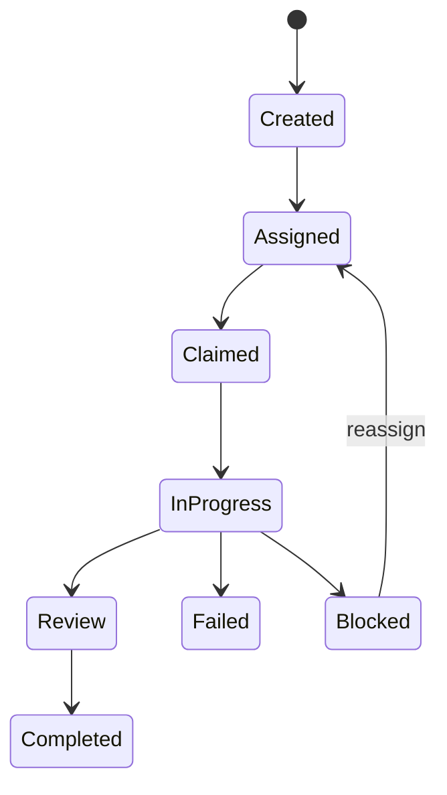

# Agent Control Plane Boundary

## Product Definition

AgentCore is a vendor-neutral control plane that manages external agents. It is not an agent, an LLM, or an agent framework. The hackathon demo narrows this product to one governed software-change society while preserving that boundary.

## Implemented Vertical Slice

The service provisions five configuration-defined `ManagedAgent` profiles. Each profile has identity, provider, adapter type, capabilities, lifecycle state, heartbeat, load, and optimistic version. The coordinator creates an `AgentTicket` for every unit of work; the deterministic router selects only an online capable agent and records why it was selected.

Every successful ticket visibly follows:

The `ModelAgentAdapter` powers the Qwen Cloud demo workers. `WebhookAgentAdapter` is a generic HMAC-signed external runtime boundary. A Codex worker, Cursor-based service, MCP service, LangChain application, or custom agent can implement that contract without changing domain or application logic.

## Qwen Responsibilities

Qwen performs evidence selection, ambiguous change interpretation, impact analysis, policy analysis, bounded rebuttals, and conflict judging. AgentCore code—not Qwen—controls scope, eligibility, routing constraints, ticket transitions, schema validation, human approval, idempotency, and audit.

## Track 3 Proof

The demo must show the registry before execution, the ticket state sequence, different capability owners, directed Universal Agent JSON messages, two evidence-bound rebuttals, the conflict verdict, the human approval stop, and the single-agent comparison. Without those visible behaviors the project risks appearing to be only an agent dashboard and would not strongly satisfy Agent Society.
