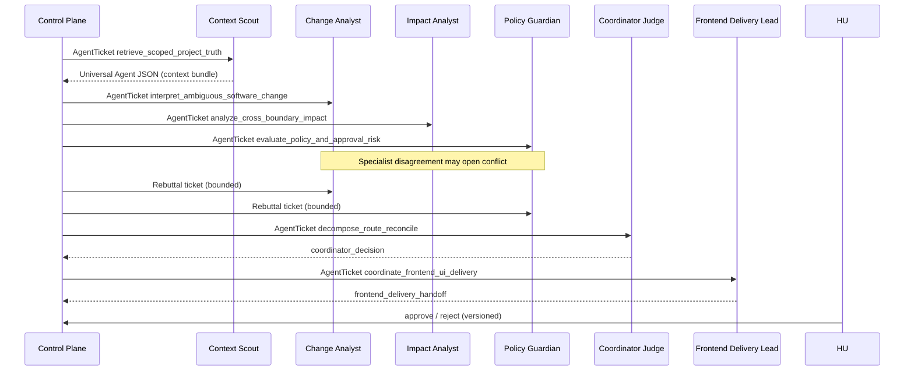

# Real Multi-Domain Agent Tests

This document describes **provable end-to-end tests** where multiple **managed agents** collaborate through **Universal Agent JSON**, **AgentTickets**, and the **control plane**. Each test is replayable and writes redacted JSON under `hackathon/evidence/`.

## What “real” means here

| Profile | Model | Proof |
|---|---|---|
| **Deterministic suite** | `DeterministicModelClient` (`fake`) | Full API + ticket FSM + negotiation + approval; no network |
| **Live Qwen suite** | `QwenCloudClient` (`qwen`) | Same workflow with a **live LLM agent** per role (tools optional via env) |

Neither suite stores API keys, raw prompts, or secrets in evidence files.

## Domains covered (seven benchmark scenarios)

Each scenario exposes **`domain`**, **`governance_rules`**, and **`feature_demonstrations`** on `GET /api/v1/projects/{id}/demo-scenarios` so judges can map orchestration value without reading source.

| Scenario ID | Domain | Policy tags (rules engine) | Governance rules (human-readable) | Features demonstrated |
|---|---|---|---|---|
| `pricing-refactor` | `revenue_and_billing` | `revenue-impacting-change` | Revenue approval; restricted memory boundary; human gate | Orchestration, negotiation, approval, frontend handoff, baseline |
| `password-migration` | `security_and_identity` | `security-sensitive-change` | Security approval; legacy migration path | Orchestration, policy tags, approval, frontend handoff, memory |
| `payment-memory` | `payments_and_reliability` | `revenue-impacting-change` | Stale memory exclusion; idempotency / revenue approval | Orchestration, context freshness, approval, frontend handoff |
| `checkout-api-refactor` | `software_engineering_api` | `api-breaking-change` | Platform/Mobile approval; mobile CI must run | Orchestration, negotiation, frontend handoff, approval |
| **`hr-compensation-export`** | **`human_resources`** | `hr-sensitive-change`, `privacy-sensitive-change` | HR/Legal export approval; PII masking & audit | Orchestration, negotiation, governance rules, frontend handoff |
| **`gdpr-erasure-automation`** | **`privacy_and_compliance`** | `privacy-sensitive-change`, `gdpr-erasure-required` | GDPR vs finance retention; Privacy/Legal approval | Orchestration, negotiation, conflicting policies, approval |
| **`vendor-access-offboarding`** | **`human_resources_and_security`** | `security-sensitive-change`, `hr-offboarding-required` | 4-hour SSO revocation; HR–Security joint offboarding | Orchestration, cross-team routing, policy tags, frontend handoff |

After specialists run, the **Frontend Delivery Coordinator** opens an additional **AgentTicket** (`coordinate_frontend_ui_delivery`) when UI/UX/API-client work is detected—including employee portal, admin offboarding, and privacy center flows.

## Agent collaboration (one society run)



Every arrow is a **durable ticket** with lifecycle states (`assigned` → `claimed` → `in_progress` → `review` → `completed`).

## Run commands (repository root)

```bash
# Deterministic: all seven domains + interaction traces (tracked under evidence/real/suite/)
bash tests/e2e/change-society/run-real-test-suite.sh

# Live Qwen: real LLM agents (requires hackathon/.env with QWEN_API_KEY)
bash tests/live/change-society/run-real-qwen-suite.sh
```

Set `CHANGE_SOCIETY_QWEN_SUITE_TOKEN_BUDGET=80000` (default in the script) if runs hit `qwen_budget_exceeded` during schema repair retries.

Single-scenario harness (backward compatible):

```bash
bash tests/e2e/change-society/run-real-test.sh
bash tests/live/change-society/run-live-test.sh remote   # deployed API
```

## Evidence artifacts

| Path | Contents |
|---|---|
| `evidence/real/suite/manifest.json` | Suite index: scenario, domain, run_id, trace paths |
| `evidence/real/suite/<scenario>.json` | Full verify report (tickets, negotiation counts, baseline) |
| `evidence/real/suite/<scenario>-interaction-trace.json` | **Redacted timeline**: role, capability, ticket id, message type, evidence refs |
| `evidence/real/society-real-test.json` | Golden-path `pricing-refactor` gate |
| `evidence/live/suite/*` | Live Qwen suite (gitignored; regenerate locally for demo video) |

Field reference: [19-evidence-artifact-index.md](19-evidence-artifact-index.md). **Executed runs (judge guide):** [27-judge-live-and-real-test-evidence.md](27-judge-live-and-real-test-evidence.md).

## How to use in a demo video

1. Show `manifest.json` scenario table (four domains).
2. Open one **coding** trace: `checkout-api-refactor-interaction-trace.json` — point at Change vs Policy messages and rebuttal steps.
3. Show managed agents list from any `<scenario>.json` (`managed_agents`, seven tickets).
4. For live proof, run `tests/live/change-society/run-real-qwen-suite.sh` and show the same trace shape with `verification_profile: live-qwen`.

## Frontend team auto-ticketing

After specialist analysis, the **Frontend Delivery Coordinator** agent receives a durable **AgentTicket** (`coordinate_frontend_ui_delivery`) when UI/UX/API-client work is detected. Live/deterministic harnesses assert:

- Message type `frontend_delivery_handoff`
- `GET /api/v1/projects/{project_id}/society-runs/{run_id}/frontend-delivery`
- Cinematic beat **frontend-handoff** in the demo UI

These suites exercise **native model adapters** (fake or Qwen). External **LangGraph** workers use the same ticket + Universal Agent JSON contract via `RunnableAgentBridge` (SDK unit tests). Wiring a compiled graph as the worker for one role is an adapter swap; the interaction traces above remain the proof format for the control plane.
