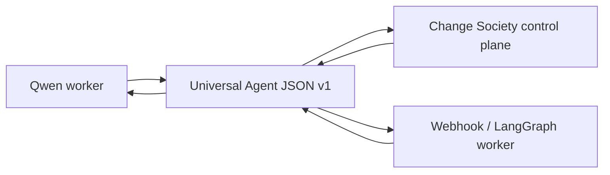

# Multi-Vendor Agent Network Ecosystem (Demo Mapping)

This document summarizes how the **Change Society hackathon demo** proves the first layer of a **multi-vendor agent network** that speaks one **common language**. The full product vision, federation model, and broker roadmap live in the platform doc:

**Canonical reference:** [`docs/05-interoperability-ecosystem/09-multi-vendor-agent-network-ecosystem.md`](../../docs/05-interoperability-ecosystem/09-multi-vendor-agent-network-ecosystem.md)

## What We Are Building Toward

An ecosystem where:

- Agents built with **different vendors and frameworks** (Qwen, LangGraph, Codex, Cursor workers, MCP, custom services) participate as **peers** on governed work.
- They interact through **Universal Agent JSON v1**, not through each other's private prompts or tool APIs.
- At **network scale**, separate organizations or control planes can exchange **signed, scoped, auditable** messages without sharing agent memory or merging databases (federation — roadmap).

## What the Demo Implements Today

| Ecosystem capability | Demo evidence |
|---------------------|---------------|
| **Common language** | Every exchange is **Universal Agent JSON v1** — see [04-protocol-and-sdk.md](04-protocol-and-sdk.md) and `change_society/contracts/messages.py`. |
| **Multiple vendor runtimes** | **ModelAgentAdapter** (Qwen Cloud) and **WebhookAgentAdapter** (HMAC-signed external workers) — see [10-agent-control-plane-boundary.md](10-agent-control-plane-boundary.md). |
| **Registry before execution** | **ManagedAgent** profiles with capabilities, heartbeat, and lifecycle — visible in API and UI. |
| **Governed collaboration** | Directed messages between roles, rebuttals, conflict verdict, human approval — [02-architecture.md](02-architecture.md). |
| **Framework-neutral SDK** | `agentcore_agent_sdk` translators and `RunnableAgentBridge` — [11-agent-language-and-langchain-sdk.md](11-agent-language-and-langchain-sdk.md). |
| **Broker pub/sub** | Not deployed in demo; contracts described in platform interoperability docs. |
| **Federated peers** | Architecture defined in platform doc § Layer 4; not required for judged offline demo. |

## Why One Language Matters for Judges

Without Universal Agent JSON, each agent pair would need a custom integration. The demo shows **one envelope** for task assignment, findings, rebuttals, decisions, and approvals — with **ticket IDs**, **correlation**, and **evidence refs** — so replacement of any single worker (another model, another framework) does not rewrite the control plane.

## Proof Checklist (Track 3 / Agent Society)

When reviewing the submission, confirm:

- [ ] **Managed agents** listed with distinct capabilities before a run executes.
- [ ] **Ticket lifecycle** visible (created → assigned → claimed → in progress → review → completed or blocked).
- [ ] **Directed messages** between roles use typed Universal Agent JSON, not free-form chat routing.
- [ ] **At least two** evidence-bound rebuttal or negotiation steps where applicable.
- [ ] **Human approval** stop for high-risk paths.
- [ ] **Webhook path** documented as interchangeable external runtime (optional live demo).

## Code Anchors

| Area | Path |
|------|------|
| Message contract | `hackathon/backend/change-society-service/src/change_society/contracts/messages.py` |
| Adapters | `hackathon/backend/change-society-service/src/change_society/infrastructure/agent_adapters.py` |
| Runtime SDK | `hackathon/sdk/python/agentcore_agent_sdk/` |
| Society client SDK | `hackathon/sdk/python/change_society_sdk/` |

## Related Hackathon Docs

- [02-architecture.md](02-architecture.md) — full HLD/LLD
- [04-protocol-and-sdk.md](04-protocol-and-sdk.md) — protocol and client usage
- [22-real-multi-domain-agent-tests.md](22-real-multi-domain-agent-tests.md) — multi-domain scenarios
