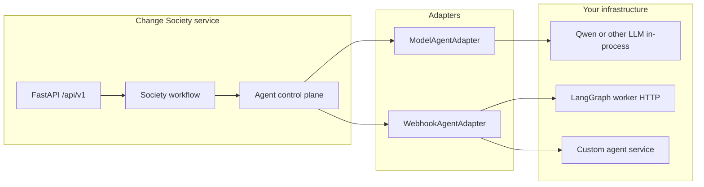
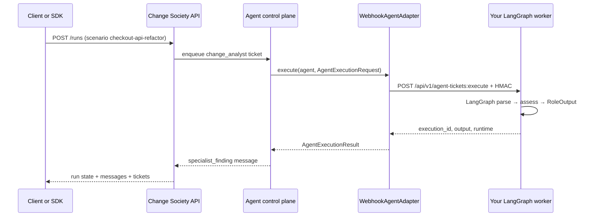

# External Agent Integrator Guide

Complete guide for developers who want to **use** AgentCore Change Society as a control plane and **bring their own agents** (LangGraph, LangChain, custom Python, remote services, MCP-backed workers, etc.).

## Audience and outcomes

After following this guide you should be able to:

1. Call society runs from Python (`change_society_sdk`) or HTTP/OpenAPI.
2. Implement a **signed webhook worker** that satisfies `WebhookAgentAdapter`.
3. Optionally embed LangGraph via `RunnableAgentBridge` without coupling domain logic to LangChain.
4. Register workers in `managed-agents.json` with `adapter_type: webhook` and `endpoint`.
5. Run the **reference implementation**: [../examples/external-change-analyst-worker/README.md](../examples/external-change-analyst-worker/README.md).

Related: [04-protocol-and-sdk.md](04-protocol-and-sdk.md), [10-agent-control-plane-boundary.md](10-agent-control-plane-boundary.md), [11-agent-language-and-langchain-sdk.md](11-agent-language-and-langchain-sdk.md), [23-multi-vendor-agent-network-ecosystem.md](23-multi-vendor-agent-network-ecosystem.md).

---

## Architecture: control plane vs your runtime



**AgentCore owns:** scope, tickets, routing, Universal Agent JSON persistence, policy gates, human approval, idempotency, audit.

**You own:** model loops, tools, private graph state, scaling, secrets for your worker.

---

## Integration pattern A — Orchestrator client only

Use when you do **not** replace workers — you drive the product API.

### Python

```python
from change_society_sdk import ChangeSocietyClient, Scope

client = ChangeSocietyClient(
    "http://localhost:32500",
    Scope("demo-tenant", "demo-workspace", "demo-project", "your-service-account"),
)

run = client.create_run("checkout-api-refactor", request_text="Optional override text...")
messages = client.list_messages(run["run_id"])
tickets = client.list_agent_tickets(run["run_id"])
evaluation = client.evaluate_baseline(run["run_id"])  # includes ablation variants

# After run reaches awaiting_approval:
client.decide(run["run_id"], "approve", "Reason...", run["version"])
```

`PYTHONPATH`:

```text
hackathon/sdk/python
hackathon/backend/change-society-service/src   # only if importing domain types
```

### HTTP

Same routes as the demo UI (`frontend/lib/api.ts`). Required headers:

- `X-Tenant-Id`, `X-Workspace-Id`, `X-Actor-Id`
- `Idempotency-Key` on POST commands
- Optional `X-Correlation-Id`

OpenAPI: run service and open `/docs`.

---

## Integration pattern B — Signed webhook worker (recommended for LangGraph)

This matches production boundaries: your graph runs in **your** service; AgentCore calls you per ticket.

### Contract (control plane → worker)

| Item | Value |
|------|--------|
| Method | `POST` |
| Path | `{endpoint}/api/v1/agent-tickets:execute` |
| Body | JSON `AgentCoreExecutionTask` (`contract_version: "1.0"`) |
| Auth | HMAC-SHA256 hex digest of **canonical JSON body** in header `X-AgentCore-Signature` |
| Secret | `CHANGE_SOCIETY_WEBHOOK_AGENT_SECRET` (server) = `AGENTCORE_WEBHOOK_SHARED_SECRET` (worker) |

Body fields (v1):

| Field | Description |
|-------|-------------|
| `ticket_id` | Durable ticket id |
| `agent_id` | Managed agent id |
| `role` | e.g. `change_analyst` |
| `system_prompt` | Role system instructions |
| `user_prompt` | Evidence + request + prior findings |
| `output_schema` | Pydantic JSON schema for required output |
| `correlation_id` | Trace id |

### Response (worker → control plane)

```json
{
  "contract_version": "1.0",
  "execution_id": "external:ticket_abc",
  "output": { },
  "usage": { "input_tokens": 0, "output_tokens": 0 },
  "duration_ms": 120,
  "runtime": "langgraph-change-analyst"
}
```

`output` must validate against the schema for that invocation (`RoleOutput`, `ContextOutput`, `JudgeOutput`, `FrontendDeliveryOutput`, …).

### Worker-side SDK

```python
from agentcore_agent_sdk import SignedWebhookWorker, AgentCoreExecutionTask

worker = SignedWebhookWorker(shared_secret, my_executor)

def my_executor(task: AgentCoreExecutionTask) -> dict:
    # invoke LangGraph, return dict matching RoleOutput
    ...
```

Reference FastAPI wiring: [../examples/external-change-analyst-worker/src/worker/main.py](../examples/external-change-analyst-worker/src/worker/main.py).

Server-side adapter: `WebhookAgentAdapter` in `infrastructure/agent_adapters.py`.

### Readiness

AgentCore may call `GET {endpoint}/ready` for health. Return HTTP 200 JSON.

---

## Integration pattern C — LangGraph `invoke` bridge (in-process)

Use when your graph runs **inside** a custom dispatcher you control, but you still speak Universal Agent JSON.

```python
from agentcore_agent_sdk import RunnableAgentBridge, UniversalAgentMessage

bridge = RunnableAgentBridge(compiled_graph)
result_mapping = bridge.execute(universal_task_message)
```

Translators: `LangChainMessageTranslator`, `LangGraphMessageTranslator`, `TranslatorRegistry`.

Tests: `tests/backend/change-society-service/test_agent_runtime_sdk.py`.

This pattern does **not** by itself register a remote worker — wire it inside **your** webhook `executor` or a custom adapter in a fork.

---

## Integration pattern D — Full LangGraph fleet (all six roles, live Qwen)

Use when you want the **strongest integrator demo**: every specialist ticket is executed by **your** LangGraph worker via the signed webhook, with **live Qwen** inside each graph step. AgentCore remains the orchestrator (tickets, negotiation, approval, audit).

| Item | Value |
|------|--------|
| Registry | `config/managed-agents.integrator-live-all.example.json` |
| Worker | [../examples/external-change-analyst-worker/](../examples/external-change-analyst-worker/) with `WORKER_LIVE_MODE=1` |
| Runtime string | `langgraph-sdk-society-worker` (set via `WORKER_RUNTIME_NAME`) |
| Seven-scenario proof | `bash tests/live/change-society/run-langgraph-sdk-live-seven-scenarios.sh` |
| Full documentation | [29-langgraph-sdk-live-seven-scenarios.md](29-langgraph-sdk-live-seven-scenarios.md) |

Contrast with [28-judge-seven-scenario-live-qwen-smoke.md](28-judge-seven-scenario-live-qwen-smoke.md): that path uses **in-process** `ModelAgentAdapter` + Qwen on the society service — no external LangGraph worker per ticket.

---

## Registering managed agents

Agents are defined in JSON (default `config/managed-agents.json`). For integrators, use:

`config/managed-agents.integrator.example.json`

Example webhook agent:

```json
{
  "key": "change-analyst",
  "name": "External Change Analyst (LangGraph)",
  "provider": "langgraph-worker",
  "adapter_type": "webhook",
  "role": "change_analyst",
  "capabilities": ["interpret_ambiguous_software_change"],
  "endpoint": "http://localhost:32510",
  "description": "External LangGraph worker."
}
```

Enable:

```bash
export CHANGE_SOCIETY_MANAGED_AGENTS_CONFIG=/absolute/path/to/managed-agents.integrator.example.json
export CHANGE_SOCIETY_WEBHOOK_AGENT_SECRET=your-shared-secret
```

On startup, `AgentControlPlane.ensure_agents` provisions agents and **syncs `endpoint` and `adapter_type`** from template when the template key already exists (see `test_integrator_agent_registry.py`).

Routing: `CapabilityRouter` picks an **online** agent that supports the ticket capability with lowest `active_ticket_count`.

---

## Role → output schema reference

| Role | Typical schema | Notes |
|------|----------------|-------|
| `context_scout` | `ContextOutput` | Includes `included_evidence`, `excluded_evidence` |
| `change_analyst` | `RoleOutput` | Negotiation / rebuttal uses same schema |
| `impact_analyst` | `RoleOutput` | |
| `policy_guardian` | `RoleOutput` | Policies list uses policy **tags** |
| `coordinator_judge` | `JudgeOutput` | Verdict + `required_approvers` |
| `frontend_delivery_lead` | `FrontendDeliveryOutput` | UI/UX/API-client handoff |
| `single_agent_baseline` | `RoleOutput` | Evaluation only |

Source of truth: `contracts/messages.py`.

---

## End-to-end integrator runbook

### 1. Start reference worker

Follow [../examples/external-change-analyst-worker/README.md](../examples/external-change-analyst-worker/README.md).

### 2. Configure society service

```bash
export CHANGE_SOCIETY_MODEL_PROVIDER=fake   # or qwen
export CHANGE_SOCIETY_WEBHOOK_AGENT_SECRET=integrator-demo-secret-change-me
export CHANGE_SOCIETY_MANAGED_AGENTS_CONFIG=hackathon/backend/change-society-service/config/managed-agents.integrator.example.json
```

### 3. Start API (port 32500 policy — see platform docs)

```bash
PYTHONPATH=hackathon/backend/change-society-service/src:hackathon/sdk/python \
  .venv/bin/uvicorn change_society.bootstrap.container:build_app --factory --host 0.0.0.0 --port 32500
```

### 4. Create run and verify external execution

```bash
PYTHONPATH=hackathon/sdk/python \
  .venv/bin/python - <<'PY'
from change_society_sdk import ChangeSocietyClient, Scope
c = ChangeSocietyClient("http://localhost:32500", Scope("demo-tenant","demo-workspace","demo-project","integrator"))
run = c.create_run("checkout-api-refactor")
for t in c.list_agent_tickets(run["run_id"]):
    if "change" in t.get("capability","") or t.get("title","").lower().find("change")>=0:
        print(t["ticket_id"], t.get("execution_metrics"))
PY
```

Expect change-analyst ticket `execution_metrics.runtime` reflecting external worker.

### 5. Observe Universal Agent JSON

```bash
# SDK or UI — messages with sender_role change_analyst should reflect graph summaries
```

---

## Universal Agent JSON (for custom bridges)

Envelope: `agentcore_agent_sdk.protocol.UniversalAgentMessage`.

Persisted messages include `message_type` (`task_assignment`, `specialist_finding`, `rebuttal_response`, …). Your worker is invoked at **ticket execution** time; the society service maps model output to `specialist_finding` messages.

Do not bypass schema validation — invalid JSON fails the ticket (`FAILED` state).

---

## Security checklist

- Rotate `CHANGE_SOCIETY_WEBHOOK_AGENT_SECRET`; never commit secrets.
- Use TLS in production between control plane and workers.
- Validate HMAC with constant-time compare (`SignedWebhookWorker` does).
- Treat `user_prompt` as untrusted (evidence injection) — same as Qwen path.
- Least privilege: worker only needs outbound model API if using LLM; control plane holds tenant scope.

---

## Troubleshooting

| Symptom | Likely cause | Fix |
|---------|----------------|-----|
| `agent_adapter_not_configured` | Missing secret or endpoint | Set secret; set `endpoint` in agent JSON |
| HTTP 401 on worker | Signature mismatch | Canonical JSON (`sort_keys=True`, compact separators); same secret |
| HTTP 422 on worker | Wrong role or schema | Return all required `RoleOutput` fields |
| Ticket FAILED schema | Extra/forbidden JSON keys | `extra=forbid` on Pydantic models |
| Still uses Qwen for change | Wrong registry file | `CHANGE_SOCIETY_MANAGED_AGENTS_CONFIG`; restart API |
| Agent not selected | Agent offline / wrong capability | Heartbeat; match capability string exactly |

---

## Testing

| Test | Location |
|------|----------|
| SDK translators + bridge | `tests/backend/change-society-service/test_agent_runtime_sdk.py` |
| Webhook adapter (mock HTTP) | `tests/backend/change-society-service/test_agent_adapters.py` |
| Endpoint sync on `ensure_agents` | `tests/backend/change-society-service/test_integrator_agent_registry.py` |
| Integrator registry JSON | `tests/backend/change-society-service/test_integrator_registry_config.py` |
| SDK execution task + HMAC errors | `tests/backend/change-society-service/test_integrator_sdk_contract.py` |
| Reference worker graph | `tests/backend/change-society-service/test_integrator_worker_graph.py` |
| Reference worker executor / settings | `tests/backend/change-society-service/test_integrator_worker_executor.py` |
| Reference worker HTTP + HMAC | `tests/backend/change-society-service/test_integrator_worker_http.py` |
| Adapter ↔ worker bridge | `tests/backend/change-society-service/test_integrator_webhook_bridge.py` |
| Worker package smoke (local) | `hackathon/examples/external-change-analyst-worker/tests/` |

**Documentation:** [../examples/external-change-analyst-worker/docs/TESTING.md](../examples/external-change-analyst-worker/docs/TESTING.md)

```bash
# All integrator unit tests (recommended for CI / judges)
bash tests/backend/change-society-service/run-integrator-unit-tests.sh

# Worker contract only (no society API)
bash hackathon/examples/external-change-analyst-worker/scripts/smoke_worker.sh

# Full stack: worker + society API + checkout-api-refactor run
bash tests/e2e/change-society/run-integrator-e2e.sh

# Full society verify + redacted evidence (recommended real integrator proof)
bash tests/e2e/change-society/run-integrator-real-test.sh

# Live: all roles via external LangGraph+Qwen worker (requires QWEN_API_KEY)
bash tests/live/change-society/run-integrator-live-test.sh

# Live: seven benchmark scenarios, all tickets on LangGraph worker (recommended judge demo)
bash tests/live/change-society/run-langgraph-sdk-live-seven-scenarios.sh
```

---

## Ticket lifecycle (webhook worker)

When a society run reaches the **change analyst** stage, the control plane:

1. Creates an `agent_ticket` with capability `interpret_ambiguous_software_change`.
2. Selects a managed agent where `adapter_type` is `webhook`, `endpoint` is reachable, and `/ready` returns 200.
3. Builds `user_prompt` from request text, scoped evidence, and (during negotiation) peer findings or a **ONE BOUNDED REBUTTAL** block.
4. POSTs canonical JSON to `{endpoint}/api/v1/agent-tickets:execute` with HMAC header.
5. Validates `output` against the ticket’s Pydantic schema (`RoleOutput` for change analyst).
6. Persists a Universal Agent JSON `specialist_finding` message and advances the workflow.

Your LangGraph worker should treat **rebuttal** prompts differently from the first pass — the reference graph lowers risk on the initial `taxIncluded`/OpenAPI pass and raises it when rebuttal evidence is present (see `src/worker/graph/nodes.py`).



---

## Sample execution request (control plane → worker)

Headers:

```http
Content-Type: application/json
X-AgentCore-Signature: <hmac-sha256-hex of body>
X-Correlation-Id: <optional trace id>
```

Body (abbreviated; real prompts are longer and include evidence blocks):

```json
{
  "contract_version": "1.0",
  "ticket_id": "ticket_01HXYZ",
  "agent_id": "managed_agent_change_analyst",
  "role": "change_analyst",
  "system_prompt": "You are the Change Analyst...",
  "user_prompt": "REQUEST:\nRefactor checkout handler...\nEVIDENCE:\n[ev_api_diff] ...",
  "output_schema": { "title": "RoleOutput", "type": "object" },
  "correlation_id": "corr_abc"
}
```

Canonical signing (must match server and worker):

```python
import hashlib, hmac, json
body = {...}
encoded = json.dumps(body, sort_keys=True, separators=(",", ":")).encode()
signature = hmac.new(secret.encode(), encoded, hashlib.sha256).hexdigest()
```

Successful worker response:

```json
{
  "contract_version": "1.0",
  "execution_id": "external:ticket_01HXYZ",
  "output": {
    "summary": "...",
    "risk_level": "high",
    "findings": [],
    "impacts": ["mobile clients", "taxIncluded field"],
    "policies": [],
    "tasks": [],
    "evidence_refs": ["ev_api_diff"],
    "assumptions": [],
    "unresolved_questions": [],
    "confidence": 0.88,
    "recommended_action": "..."
  },
  "usage": { "input_tokens": 0, "output_tokens": 0 },
  "duration_ms": 42,
  "runtime": "langgraph-change-analyst"
}
```

---

## Build your own worker (checklist)

1. **Choose pattern** — HTTP webhook (recommended) or in-process `RunnableAgentBridge` inside your service.
2. **Implement executor** — `(AgentCoreExecutionTask) -> dict` validated against the schema for that role.
3. **Expose HTTP** — `GET /ready`, `POST /api/v1/agent-tickets:execute` with `SignedWebhookWorker` from `agentcore_agent_sdk`.
4. **Register agent** — JSON entry with matching `role`, `capabilities`, `adapter_type: webhook`, `endpoint` URL (host reachable from the society service container/process).
5. **Align secrets** — `CHANGE_SOCIETY_WEBHOOK_AGENT_SECRET` = `AGENTCORE_WEBHOOK_SHARED_SECRET`.
6. **Verify** — `smoke_worker.sh`, then `tests/e2e/change-society/run-integrator-e2e.sh`.
7. **Optional LLM** — keep graph deterministic for demos; set `WORKER_USE_LLM=1` only when Qwen credentials are available.

Copy the reference layout:

```text
your-worker/
  src/your_worker/main.py          # FastAPI + SignedWebhookWorker
  src/your_worker/executor.py      # role switch + schema validation
  src/your_worker/graph/           # LangGraph or custom pipeline
  tests/test_webhook_contract.py   # HMAC + schema tests
  Dockerfile                       # PYTHONPATH includes agentcore_agent_sdk
```

---

## MCP, LangChain tools, and other runtimes

This hackathon does **not** expose MCP directly on the control plane. Typical pattern:

- Your worker is an MCP **client** (tools, retrieval, private repos).
- AgentCore remains the **orchestrator** (policy, approvals, audit, Universal Agent JSON).
- Tool calls and graph checkpoints stay inside the worker; only the final schema-bound `output` crosses the webhook boundary.

The same applies to CrewAI, AutoGen, or a plain FastAPI microservice — implement the webhook contract; routing is capability-based, not framework-based.

---

## Docker and Compose (integrator profile)

Worker only:

```bash
docker compose -f hackathon/examples/external-change-analyst-worker/docker-compose.integrator.yml up --build
```

Society API with integrator registry (uncomment the `change-society` service block in that compose file, or run `tests/e2e/change-society/run-integrator-e2e.sh` locally).

Ensure `endpoint` in JSON uses a hostname the **society service** can resolve (`host.docker.internal`, service name on a shared network, or published host port).

---

## Current limitations (hackathon scope)

- Dynamic agent registration API (agents come from JSON templates + `ensure_agents`).
- Published PyPI package (use `PYTHONPATH` to `hackathon/sdk/python`).
- npm SDK (use `frontend/lib/api.ts` as reference).
- Automatic LangGraph registration in the default demo (`managed-agents.json` uses `model` adapters for all roles).

---

## Next steps for product hardening

- Per-role worker deployments and autoscaling.
- mTLS in addition to HMAC.
- Separate secrets per agent.
- OpenTelemetry trace propagation via `X-Correlation-Id`.
- Register additional webhook agents using the same pattern as the reference worker.
