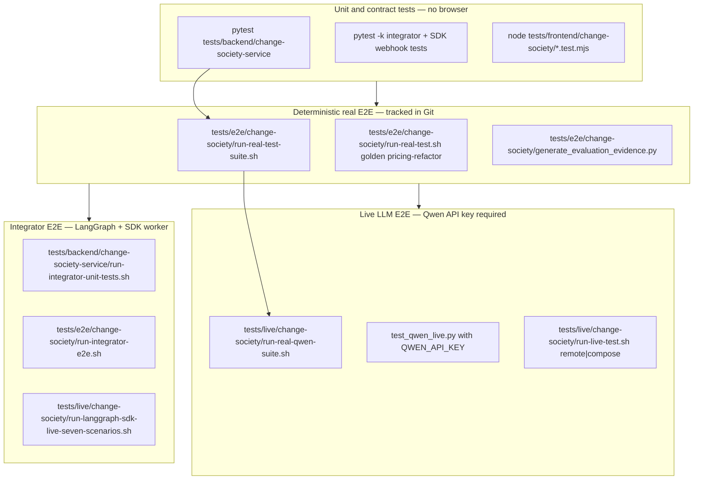
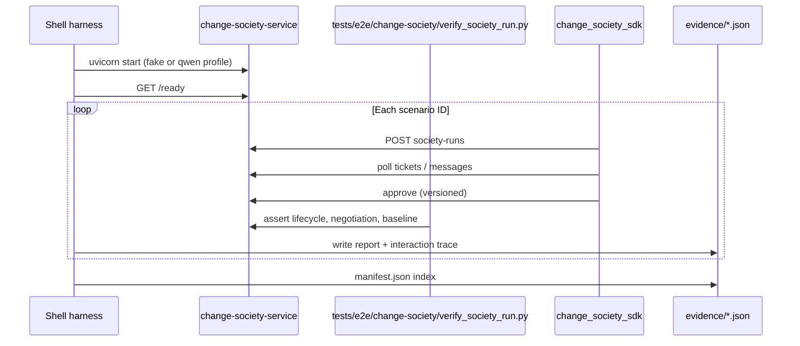
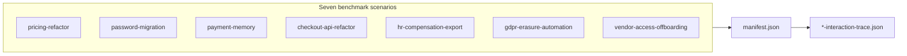
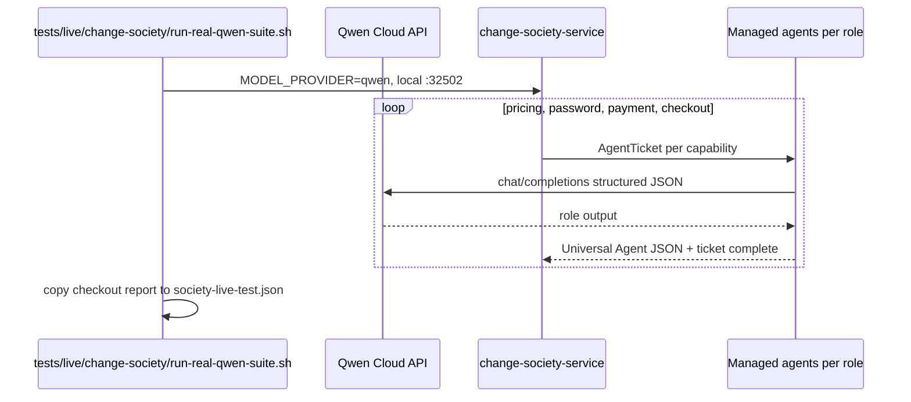
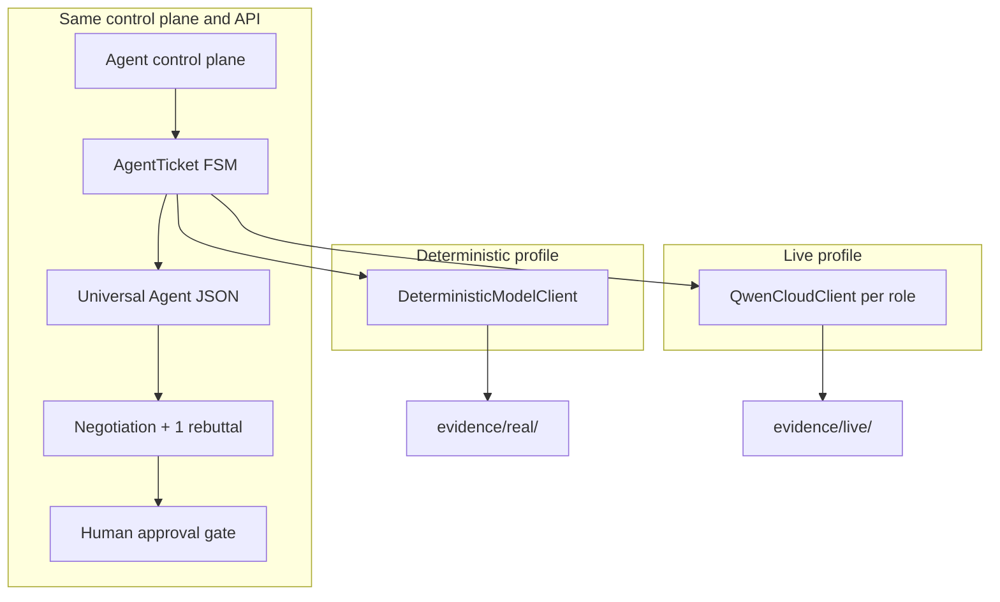
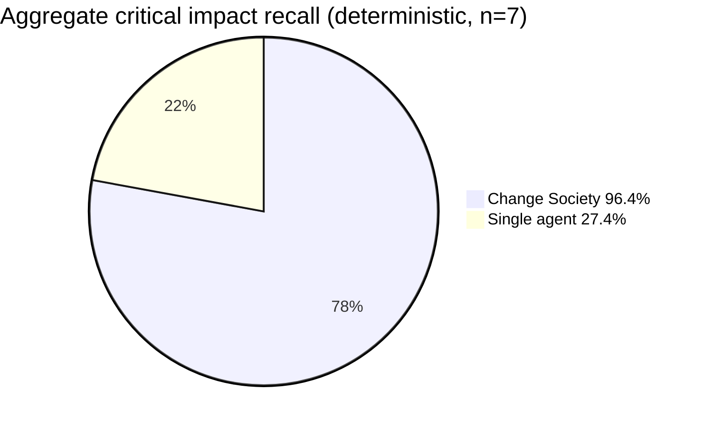
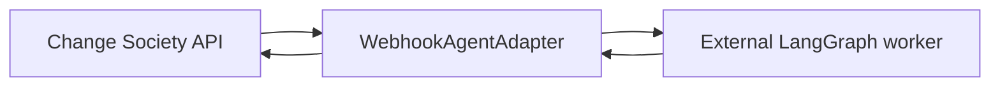

# Live and Real Test Evidence (Judge Guide)

English summary for **Track 3 judges**: which end-to-end and live tests were run, what they prove, where redacted JSON lives, and how to reproduce. All diagrams use **Mermaid** for quick navigation.

Related: [22-real-multi-domain-agent-tests.md](22-real-multi-domain-agent-tests.md), [19-evidence-artifact-index.md](19-evidence-artifact-index.md), [06-testing-and-evaluation.md](06-testing-and-evaluation.md), [16-claim-evidence-mapping.md](16-claim-evidence-mapping.md).

---

## Test tiers (what “real” vs “live” means)



| Tier | Model / store | Network to Qwen | Evidence path | In Git? |
|------|----------------|-----------------|---------------|---------|
| **Unit** | N/A | No | pytest output | Tests in repo |
| **Deterministic real** | `fake` + in-memory | No | `hackathon/evidence/real/` | **Yes** (`real/` tracked) |
| **Live Qwen suite** | `qwen` + in-memory (local server) | **Yes** | `hackathon/evidence/live/` | Usually **gitignored**; include in private bundle for judges |
| **Live remote API** | Production-shaped deploy | Yes | `evidence/live/society-live-test.json` | Entrant-hosted URL + redacted JSON |
| **Integrator (LangGraph + SDK)** | webhook worker + live Qwen in worker | **Yes** | `evidence/live/integrator-langgraph-qwen/` | Tests in repo; live folder gitignored |
| **Integrator smoke** | fake society + change-analyst worker only | No | E2E script | Tests in repo |

---

## Harness flow (how E2E tests run)



Assertions include: multi-role tickets, **exactly one** rebuttal round where applicable, conflict + judge message, `awaiting_approval` → human approve → `completed`, frontend delivery ticket when UI work is detected, baseline vs society metrics.

---

## Executed: deterministic real suite (seven domains)

**Command:** `bash tests/e2e/change-society/run-real-test-suite.sh`  
**Profile:** `verification_profile: deterministic`, `test_family: real_deterministic`  
**Last indexed run (manifest):** `2026-07-12T09:03:39Z`  
**Index file:** [../evidence/real/suite/manifest.json](../evidence/real/suite/manifest.json)



| Scenario ID | Domain | Tickets | Messages | Rebuttals | Roles observed | Per-scenario report |
|---------------|--------|---------|----------|-----------|----------------|---------------------|
| `pricing-refactor` | revenue_and_billing | 8 | 21 | 2 | 6 roles + coordinator | [pricing-refactor.json](../evidence/real/suite/pricing-refactor.json) |
| `password-migration` | security_and_identity | 8 | 21 | 2 | 6 + coordinator | [password-migration.json](../evidence/real/suite/password-migration.json) |
| `payment-memory` | payments_and_reliability | 8 | 21 | 2 | 6 + coordinator | [payment-memory.json](../evidence/real/suite/payment-memory.json) |
| **`checkout-api-refactor`** | software_engineering_api | 8 | 21 | 2 | 6 + coordinator | [checkout-api-refactor.json](../evidence/real/suite/checkout-api-refactor.json) |
| `hr-compensation-export` | human_resources | 8 | 21 | 2 | 6 + coordinator | [hr-compensation-export.json](../evidence/real/suite/hr-compensation-export.json) |
| `gdpr-erasure-automation` | privacy_and_compliance | 8 | 21 | 2 | 6 + coordinator | [gdpr-erasure-automation.json](../evidence/real/suite/gdpr-erasure-automation.json) |
| `vendor-access-offboarding` | human_resources_and_security | 8 | 21 | 2 | 6 + coordinator | [vendor-access-offboarding.json](../evidence/real/suite/vendor-access-offboarding.json) |

**Outcome:** each per-scenario report records `final_state: completed`, `ticket_lifecycle_verified: true`, and redacted `baseline_comparison` (society vs single-agent baseline).

**Golden single-scenario gate:** [../evidence/real/society-real-test.json](../evidence/real/society-real-test.json) (`pricing-refactor`, same harness family).

**Interaction traces:** open any `*-interaction-trace.json` — timeline steps show `sender_role`, `message_type`, `capability`, `task_ref`, `evidence_refs`, and redacted `payload_excerpt` (no secrets).

---

## Executed: live Qwen multi-domain suite (four scenarios)

**Command:** `bash tests/live/change-society/run-real-qwen-suite.sh` (requires `QWEN_API_KEY` in `hackathon/.env`)  
**Profile:** `verification_profile: live-qwen`  
**Model (readiness snapshot):** `qwen-flash`, `provider: qwen_cloud`, role tools enabled  
**Last indexed run (manifest):** `2026-07-12T08:47:55Z`  
**Index file:** [../evidence/live/suite/manifest.json](../evidence/live/suite/manifest.json) *(local / bundle; directory gitignored by default)*



| Scenario ID | Domain (manifest label) | Tickets | Messages | Rebuttals | Live report |
|-------------|-------------------------|---------|----------|-----------|-------------|
| `pricing-refactor` | revenue / billing | 7 | 19 | 2 | [live suite/pricing-refactor.json](../evidence/live/suite/pricing-refactor.json) |
| `password-migration` | security / auth | 7 | 19 | 2 | [live suite/password-migration.json](../evidence/live/suite/password-migration.json) |
| `payment-memory` | payments / reliability | 4 | 11 | 0 | [live suite/payment-memory.json](../evidence/live/suite/payment-memory.json) |
| **`checkout-api-refactor`** | coding / API contract | 7 | 17 | 2 | [live suite/checkout-api-refactor.json](../evidence/live/suite/checkout-api-refactor.json) |

**Golden live report (checkout, primary demo):** [../evidence/live/society-live-test.json](../evidence/live/society-live-test.json)

| Field | Example value (checkout live run) |
|-------|-----------------------------------|
| `verification_profile` | `live-qwen` |
| `run_id` | `run_a2dc440d1ee74ec3b76cf10e14ffbe44` |
| `ticket_lifecycle_verified` | `true` |
| `society_metrics.total_tokens` | ~16808 (multi-role live cost visible) |
| `society_metrics.critical_impact_recall` | 0.5 on this single live run (vs higher on deterministic profile) |
| `/ready` in report | `status: degraded` when store is in-memory (expected for local live harness) |

**Additional live sample:** [../evidence/live/society-flash-live-test.json](../evidence/live/society-flash-live-test.json) — `pricing-refactor` with live tokens/latency (`verification_profile: auto`).

**Pytest live adapter check:** `tests/backend/change-society-service/test_qwen_live.py` (runs only when `QWEN_API_KEY` is set; schema-valid `RoleOutput` from real Qwen).

---

## Deterministic vs live (same workflow, different model)



| Aspect | Deterministic (`real/`) | Live Qwen (`live/`) |
|--------|-------------------------|---------------------|
| Reproducibility | High — same metrics for CI | Depends on model; store traces, not exact numbers |
| Token / latency | Fixed, low | Real billing-style totals |
| Judge use | Regression + benchmark table | Proves **real LLM agents** on Track 3 |
| Safe claim | “Fixed scenario, fake model, full workflow” | “Live Qwen structured outputs on same API” |

---

## Benchmark and ablation (deterministic, seven scenarios)

**Producer:** `python tests/e2e/change-society/generate_evaluation_evidence.py`  
**Artifacts:**

- [../evidence/real/evaluation-scenarios.json](../evidence/real/evaluation-scenarios.json) — per-scenario society vs baseline + **four ablation variants**
- [../evidence/real/benchmark-summary.json](../evidence/real/benchmark-summary.json) — aggregate judge table



| Metric (aggregate) | Single agent | Change Society | Source |
|------------------|--------------|----------------|--------|
| Critical impact recall | 0.27 (7/26) | **0.96 (25/26)** | `benchmark-summary.json` |
| Policy match recall | 0.0 (0/10) | **1.0 (10/10)** | same |
| Task completeness | 0.33 | **1.0** | same |
| Avg tokens | ~200 | ~1400 | same (tradeoff disclosed) |

**Caveat (required wording):** fixed synthetic scenarios, not statistically significant; live Qwen repeats may differ. See [24-baseline-ablation-and-efficiency.md](24-baseline-ablation-and-efficiency.md).

---

## Integrator tests (LangGraph worker + AgentCore SDK)

**Primary live proof (seven scenarios, all roles external):** [29-langgraph-sdk-live-seven-scenarios.md](29-langgraph-sdk-live-seven-scenarios.md)

| Test | Command | Proves |
|------|---------|--------|
| Unit | `bash tests/backend/change-society-service/run-integrator-unit-tests.sh` | Graph, HMAC webhook, adapter bridge, registry JSON, all-role LangGraph registry |
| E2E | `bash tests/e2e/change-society/run-integrator-e2e.sh` | Worker :32510 + API + `checkout-api-refactor` with external change analyst |
| **Real society verify** | `bash tests/e2e/change-society/run-integrator-real-test.sh` | Deterministic in-process roles + LangGraph change analyst only |
| **Live all roles** | `bash tests/live/change-society/run-integrator-live-test.sh` | One or seven scenarios; all six webhook agents → worker |
| **Live seven scenarios (recommended)** | `bash tests/live/change-society/run-langgraph-sdk-live-seven-scenarios.sh` | Same as live-all + `langgraph-sdk-judge-summary.json` + `--require-external-worker-all-roles` |

Registry: `config/managed-agents.integrator-live-all.example.json` (every role → `http://localhost:32510`).

**Last indexed LangGraph + SDK suite (local):** `2026-07-12T10:25:53Z`, **7/7 passed**, summary `evidence/live/integrator-langgraph-qwen/langgraph-sdk-judge-summary.json`.

```bash
# Recommended one-liner for judges (QWEN_API_KEY in hackathon/.env)
bash tests/live/change-society/run-langgraph-sdk-live-seven-scenarios.sh

# Single scenario (faster)
INTEGRATOR_LIVE_SUITE=0 INTEGRATOR_REAL_SCENARIO=checkout-api-refactor \
  bash tests/live/change-society/run-integrator-live-test.sh
```

Worker env: `WORKER_LIVE_MODE=1`, `WORKER_RUNTIME_NAME=langgraph-sdk-society-worker`, `AGENTCORE_WEBHOOK_SHARED_SECRET` aligned with society service.

**In-process live Qwen (no external worker):** `bash tests/live/change-society/run-qwen-judge-seven-scenarios.sh` — see [28-judge-seven-scenario-live-qwen-smoke.md](28-judge-seven-scenario-live-qwen-smoke.md).

```bash
bash tests/e2e/change-society/run-integrator-real-test.sh
# Optional: Qwen for non-webhook roles
INTEGRATOR_REAL_MODEL=qwen bash tests/e2e/change-society/run-integrator-real-test.sh
```



Detail: [26-external-agent-integrator-guide.md](26-external-agent-integrator-guide.md).

---

## Unit test coverage (supporting evidence)

| Area | Location | Judge note |
|------|----------|------------|
| Society workflow, negotiation, approval | `test_change_society.py`, `test_all_demo_domains.py` | Seven demo scenarios in pytest |
| Qwen adapter (mocked) | `test_qwen_*.py`, `test_qwen_output_normalizer.py` | Schema repair, tools, budgets |
| Control plane / webhooks | `test_agent_adapters.py`, `test_integrator_*.py` | External agent contract |
| Frontend demo state | `tests/frontend/change-society/*.test.mjs` | Cinematic beats, API client |

**Full backend command:**

```bash
PYTHONPATH=hackathon/backend/change-society-service/src:hackathon/sdk/python \
  .venv/bin/python -m pytest tests/backend/change-society-service -q \
  --ignore=tests/backend/change-society-service/test_qwen_live.py
```

Include `test_qwen_live.py` when `QWEN_API_KEY` is set for live provider proof.

---

## How judges should read evidence (5-minute path)

1. Run **`bash tests/live/change-society/run-judge-seven-scenarios.sh`** (or open a prior bundle) → **`evidence/live/judge-seven-scenarios/judge-summary.json`** — seven rows, `real_model_agents: true`, all `passed`.  
2. Open [../evidence/real/suite/manifest.json](../evidence/real/suite/manifest.json) only for **deterministic regression** (fake model)—not the primary live-agent proof.  
3. Open [../evidence/real/suite/checkout-api-refactor-interaction-trace.json](../evidence/real/suite/checkout-api-refactor-interaction-trace.json) — follow negotiation steps (deterministic trace shape; live traces live beside judge bundle).  
4. Open [../evidence/real/benchmark-summary.json](../evidence/real/benchmark-summary.json) — society vs single-agent aggregates (deterministic metrics).  
5. If bundle includes `live/`: open [../evidence/live/society-live-test.json](../evidence/live/society-live-test.json) — checkout with **live Qwen** token counts.  
6. For **LangGraph + SDK** proof (optional): open `evidence/live/integrator-langgraph-qwen/langgraph-sdk-judge-summary.json` — every row should show `external_worker: langgraph-sdk-society-worker`.  
7. Cross-check claims in [16-claim-evidence-mapping.md](16-claim-evidence-mapping.md).

---

## Reproduce (no secrets for deterministic path)

```bash
bash install.sh --profile verify
bash tests/e2e/change-society/run-real-test-suite.sh
.venv/bin/python tests/e2e/change-society/generate_evaluation_evidence.py
```

Live (entrant machine only):

```bash
# Local Qwen suite → evidence/live/
bash tests/live/change-society/run-real-qwen-suite.sh

# Or against deployed API
export CHANGE_SOCIETY_LIVE_API_URL=https://your-public-api
bash tests/live/change-society/run-live-test.sh remote
```

---

## What is not claimed by these artifacts

- Production Alibaba uptime or PostgreSQL-backed live runs (unless entrant supplies separate deploy proof).  
- Statistical generalization beyond the seven fixed scenarios.  
- Exact repetition of live Qwen numeric metrics across runs.

For deployment-shaped live gates, see [07-deployment-and-operations.md](07-deployment-and-operations.md) and [21-release-candidate-and-smoke-checklist.md](21-release-candidate-and-smoke-checklist.md).
