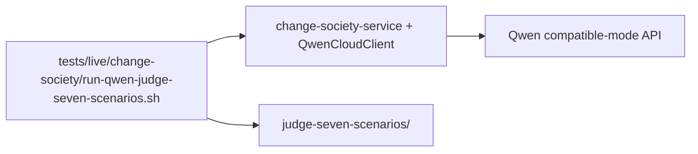

# Judge live demo — seven scenarios (real Qwen API)

English one-pager for **Track 3 judges**: prove all benchmark domains work against the **live** Qwen Cloud compatible-mode API (e.g. free-tier `qwen-flash`).

**Not the LangGraph integrator path:** specialists run **inside** change-society-service (`ModelAgentAdapter`). For **external LangGraph + `agentcore_agent_sdk`**, use [29-langgraph-sdk-live-seven-scenarios.md](29-langgraph-sdk-live-seven-scenarios.md) instead.

## One command

From repository root (requires `QWEN_API_KEY` in `hackathon/.env`):

```bash
bash tests/live/change-society/run-qwen-judge-seven-scenarios.sh
```

## What it does



| Step | Real? |
|------|--------|
| Start local API with `CHANGE_SOCIETY_MODEL_PROVIDER=qwen` | Yes |
| For **each of 7** scenario IDs: create run → tickets → negotiation → approve → baseline | Yes |
| Each specialist call hits **Qwen HTTP API** | Yes |
| Skip cross-session follow-up (saves tokens; core workflow unchanged) | Config |

## Seven scenarios

Same IDs as deterministic benchmark (`evidence/real/suite/`):

1. `pricing-refactor`
2. `password-migration`
3. `payment-memory`
4. `checkout-api-refactor` (primary video demo)
5. `hr-compensation-export`
6. `gdpr-erasure-automation`
7. `vendor-access-offboarding`

## Evidence (show judges)

| File | Purpose |
|------|---------|
| `evidence/live/judge-seven-scenarios/judge-summary.json` | **Start here** — pass/fail table |
| `evidence/live/judge-seven-scenarios/manifest.json` | Full index + readiness (`qwen_cloud`) |
| `evidence/live/judge-seven-scenarios/<scenario>.json` | Per-run verify report |
| `evidence/live/judge-seven-scenarios/<scenario>-interaction-trace.json` | Redacted Universal Agent JSON timeline |

Also updates `evidence/live/society-live-test.json` from checkout scenario.

## Tuning (optional env)

| Variable | Default | Notes |
|----------|---------|--------|
| `QWEN_JUDGE_MODEL` | `qwen-flash` | Free/cheap tier friendly |
| `CHANGE_SOCIETY_JUDGE_RUN_TOKEN_BUDGET` | `120000` | Per society run cap |
| `CHANGE_SOCIETY_JUDGE_ROLE_TOOLS` | `0` | Faster smoke; set `1` for tool-loop demo |
| `CHANGE_SOCIETY_JUDGE_SUITE_PORT` | `32504` | Local API port |

## Related

- [29-langgraph-sdk-live-seven-scenarios.md](29-langgraph-sdk-live-seven-scenarios.md) — **LangGraph + SDK**, seven scenarios, external worker (integrator demo)
- [27-judge-live-and-real-test-evidence.md](27-judge-live-and-real-test-evidence.md)
- [03-qwen-cloud-integration.md](03-qwen-cloud-integration.md)
- Deterministic regression: `bash tests/e2e/change-society/run-real-test-suite.sh` (no API key)
