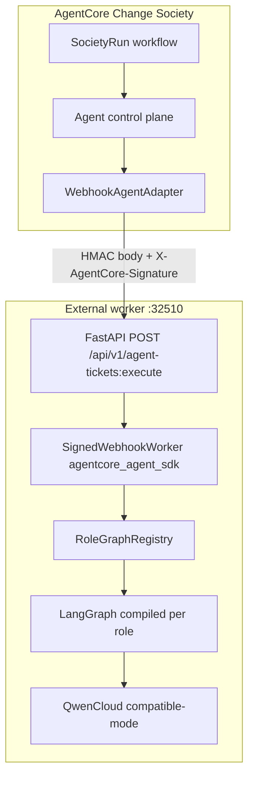
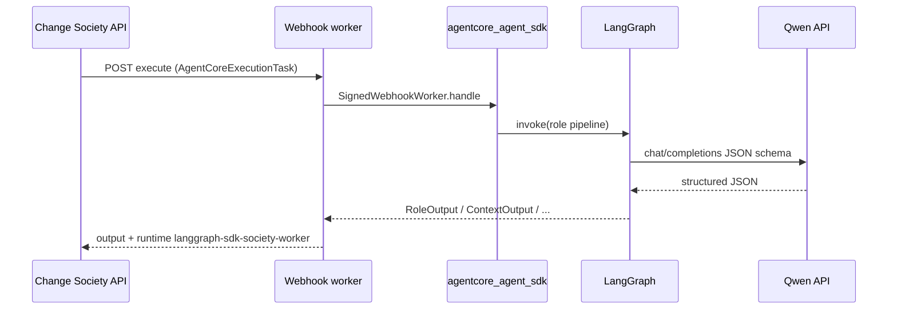

# LangGraph + AgentCore SDK — live seven-scenario integrator proof

This document is the **primary real integrator story** for Track 3 judges and developers:

- **AgentCore Change Society** = control plane (tickets, workflow, Universal Agent JSON, human approval).
- **External worker** = six managed agents implemented as **LangGraph** pipelines.
- **`agentcore_agent_sdk`** = signed webhook contract (`SignedWebhookWorker`, `LangGraphMessageTranslator`, `UniversalAgentMessage`).
- **Live Qwen Cloud** compatible-mode API inside each graph step (real HTTP, not `fake` model).

Related: [26-external-agent-integrator-guide.md](26-external-agent-integrator-guide.md), [28-judge-seven-scenario-live-qwen-smoke.md](28-judge-seven-scenario-live-qwen-smoke.md), [27-judge-live-and-real-test-evidence.md](27-judge-live-and-real-test-evidence.md).

---

## Which test should I run?

| Goal | Script | Agents | API |
|------|--------|--------|-----|
| **Real LangGraph + SDK (recommended for integrator demo)** | `run-langgraph-sdk-live-seven-scenarios.sh` | All 6 roles → external worker | Live Qwen in worker |
| In-process Qwen only (no external worker) | `run-qwen-judge-seven-scenarios.sh` | Model adapter inside society | Live Qwen in API |
| Deterministic CI / no key | `run-real-test-suite.sh` | In-process fake | None |
| Single-role LangGraph smoke | `run-integrator-e2e.sh` | Change analyst webhook only | Fake other roles |

For **“real agents with LangGraph + my SDK”**, use the **first row**.

---

## Architecture





**Control plane never runs specialist LLM loops** when `managed-agents.integrator-live-all.example.json` is loaded — every ticket is dispatched to your worker.

---

## Six roles → LangGraph → Pydantic schema

| Managed role | Capability (ticket) | Output schema | LangGraph pipeline |
|--------------|---------------------|---------------|-------------------|
| `context_scout` | `retrieve_scoped_project_truth` | `ContextOutput` | Linear: live Qwen + normalizer |
| `change_analyst` | `interpret_ambiguous_software_change` | `RoleOutput` | Specialist graph → live Qwen refine |
| `impact_analyst` | `analyze_cross_boundary_impact` | `RoleOutput` | Linear: live Qwen |
| `policy_guardian` | `evaluate_policy_and_approval_risk` | `RoleOutput` | Linear: live Qwen |
| `coordinator_judge` | `decompose_route_reconcile` | `JudgeOutput` | Linear: live Qwen |
| `frontend_delivery_lead` | `coordinate_frontend_ui_delivery` | `FrontendDeliveryOutput` | Linear: live Qwen |

Source schemas: `change_society/contracts/messages.py`.  
Worker validation uses the same **`qwen_output_normalizer`** as the main service (`validate_normalized_payload`).

---

## SDK usage (inside the worker)

### Webhook entry (required)

```python
from agentcore_agent_sdk import SignedWebhookWorker, AgentCoreExecutionTask

worker = SignedWebhookWorker(shared_secret, executor.execute)
result = worker.handle(raw_body, signature_header)
# result: contract_version, execution_id, output, runtime (overridden in main.py)
```

### LangGraph task envelope (SDK-aligned)

```python
from agentcore_agent_sdk import UniversalAgentMessage, LangGraphMessageTranslator

# Built in worker/graph/society_role_graph.py → task_to_graph_state()
message = UniversalAgentMessage(..., message_type="task_assignment", ...)
langgraph_input = LangGraphMessageTranslator().from_universal(message)
# { "messages": [...], "agentcore": { ticket_id, capability, ... } }
```

### Optional: RunnableAgentBridge (in-process graphs)

For workers that already expose a compiled LangGraph as `invoke()`:

```python
from agentcore_agent_sdk import RunnableAgentBridge, UniversalAgentMessage

bridge = RunnableAgentBridge(compiled_graph)
result = bridge.execute(universal_task_message)
```

See [11-agent-language-and-langchain-sdk.md](11-agent-language-and-langchain-sdk.md).

---

## Configuration files

| File | Purpose |
|------|---------|
| `config/managed-agents.integrator-live-all.example.json` | All six agents `adapter_type: webhook`, `endpoint: http://localhost:32510` |
| `config/managed-agents.integrator.example.json` | Change analyst webhook only; other roles in-process |
| `examples/external-change-analyst-worker/.env.example` | Worker secrets + `WORKER_LIVE_MODE` |

Society service:

```bash
export CHANGE_SOCIETY_MANAGED_AGENTS_CONFIG=hackathon/backend/change-society-service/config/managed-agents.integrator-live-all.example.json
export CHANGE_SOCIETY_WEBHOOK_AGENT_SECRET=integrator-demo-secret-change-me
export CHANGE_SOCIETY_MODEL_PROVIDER=fake   # unused when all tickets are webhook
```

Worker:

```bash
export WORKER_LIVE_MODE=1
export QWEN_API_KEY=...
export AGENTCORE_WEBHOOK_SHARED_SECRET=integrator-demo-secret-change-me
export WORKER_RUNTIME_NAME=langgraph-sdk-society-worker
```

---

## Run the seven-scenario live proof

From repository root (`hackathon/.env` must contain `QWEN_API_KEY`):

```bash
bash hackathon/scripts/run-langgraph-sdk-live-seven-scenarios.sh
```

What the script does:

1. Starts **external worker** on port **32510** (`WORKER_LIVE_MODE=1`).
2. Starts **Change Society API** on port **32503** with integrator-live-all registry.
3. Runs **`run_integrator_live_suite.py`** for all **seven** benchmark scenario IDs.
4. For each scenario: full verify (tickets, negotiation when applicable, approval, baseline).
5. Asserts **`--require-external-worker-all-roles`** — every completed ticket has `runtime: langgraph-sdk-society-worker`.
6. Writes **`langgraph-sdk-judge-summary.json`**.

Single scenario (faster):

```bash
INTEGRATOR_LIVE_SUITE=0 INTEGRATOR_REAL_SCENARIO=checkout-api-refactor \
  bash hackathon/scripts/run-integrator-live-test.sh
```

Free-tier friendly model:

```bash
export QWEN_JUDGE_MODEL=qwen-flash   # or set QWEN_MODEL in hackathon/.env
bash hackathon/scripts/run-langgraph-sdk-live-seven-scenarios.sh
```

---

## Evidence artifacts (show judges)

Directory: **`hackathon/evidence/live/integrator-langgraph-qwen/`**

| File | Content |
|------|---------|
| **`langgraph-sdk-judge-summary.json`** | One-page pass/fail table (start here) |
| `manifest.json` | Suite index, `verification_profile: integrator-live-all` |
| `<scenario-id>.json` | Full verify report; includes `langgraph_integrator.all_ticket_runtimes` |
| `<scenario-id>-interaction-trace.json` | Redacted message timeline + `ticket_runtime` per step |
| `worker.log` / `api.log` | Operational logs (no secrets) |

Example proof fields on each ticket row in the report:

```json
{
  "capability": "interpret_ambiguous_software_change",
  "runtime": "langgraph-sdk-society-worker",
  "state": "completed"
}
```

**Last recorded successful suite (development environment):** `2026-07-12T10:25:53Z`, seven scenarios, status `passed` — see checked-in or bundled `langgraph-sdk-judge-summary.json` if present.

---

## Seven benchmark scenarios

| Scenario ID | Domain |
|-------------|--------|
| `pricing-refactor` | revenue_and_billing |
| `password-migration` | security_and_identity |
| `payment-memory` | payments_and_reliability |
| **`checkout-api-refactor`** | software_engineering_api (primary demo) |
| `hr-compensation-export` | human_resources |
| `gdpr-erasure-automation` | privacy_and_compliance |
| `vendor-access-offboarding` | human_resources_and_security |

---

## Code map

| Component | Path |
|-----------|------|
| SDK package | `hackathon/sdk/python/agentcore_agent_sdk/` |
| Webhook + task contract | `webhook.py` → `AgentCoreExecutionTask`, `SignedWebhookWorker` |
| Universal Agent JSON | `protocol.py` → `UniversalAgentMessage`, translators |
| Worker FastAPI | `examples/external-change-analyst-worker/src/worker/main.py` |
| Executor | `executor.py` → `WorkerExecutor` |
| Per-role LangGraph | `graph/society_role_graph.py` → `RoleGraphRegistry` |
| Change analyst specialist graph | `graph/change_analyst_graph.py`, `graph/nodes.py` |
| Live Qwen + normalizer | `qwen_client.py` → `complete_structured()` |
| Society webhook adapter | `infrastructure/agent_adapters.py` → `WebhookAgentAdapter` |
| Suite driver | `scripts/run_integrator_live_suite.py` |
| Verify harness | `scripts/verify_society_run.py` |

---

## Tests

| Layer | Command |
|-------|---------|
| SDK + webhook unit | `tests/backend/change-society-service/test_agent_runtime_sdk.py` |
| Worker HTTP contract | `bash hackathon/examples/external-change-analyst-worker/scripts/smoke_worker.sh` |
| LangGraph role registry | `tests/backend/change-society-service/test_integrator_langgraph_roles.py` |
| Integrator unit (all) | `bash hackathon/scripts/run-integrator-unit-tests.sh` |
| **Live seven scenarios** | `bash hackathon/scripts/run-langgraph-sdk-live-seven-scenarios.sh` |

Worker testing detail: [../examples/external-change-analyst-worker/docs/TESTING.md](../examples/external-change-analyst-worker/docs/TESTING.md).

---

## Troubleshooting

| Symptom | Cause | Fix |
|---------|--------|-----|
| HTTP 422 from worker | Qwen JSON missing schema fields | Worker uses `validate_normalized_payload`; check `QWEN_API_KEY` and model |
| `agent_adapter_not_configured` | Secret / endpoint | Match `CHANGE_SOCIETY_WEBHOOK_AGENT_SECRET` and `AGENTCORE_WEBHOOK_SHARED_SECRET` |
| Ticket runtime still `qwen_cloud` | Wrong registry file | Use `managed-agents.integrator-live-all.example.json` |
| Verify fails external worker | Runtime string mismatch | Expect `langgraph-sdk-society-worker` on all tickets |
| Port in use | Previous run | Set `CHANGE_SOCIETY_INTEGRATOR_API_PORT` / `WORKER_PORT` |

Debug one role:

```bash
python hackathon/scripts/debug_worker_roles.py
```

---

## Docker

Worker container (from repo root):

```bash
docker compose -f hackathon/examples/external-change-analyst-worker/docker-compose.integrator.yml up --build
```

Set `WORKER_LIVE_MODE=1` and pass `QWEN_API_KEY` via compose env for live graphs inside the container.

---

## Judge demo script (3 minutes)

1. Open `langgraph-sdk-judge-summary.json` — seven rows, all `passed`, `external_worker: langgraph-sdk-society-worker`.
2. Open `checkout-api-refactor-interaction-trace.json` — point at steps with `ticket_runtime`.
3. Optional: UI cinematic mode on `checkout-api-refactor` while society uses the same scenario catalog.
4. State clearly: **specialists run outside AgentCore**; SDK webhook + LangGraph; control plane owns governance.

Video alignment: [17-video-storyboard-and-recording-guide.md](17-video-storyboard-and-recording-guide.md).
